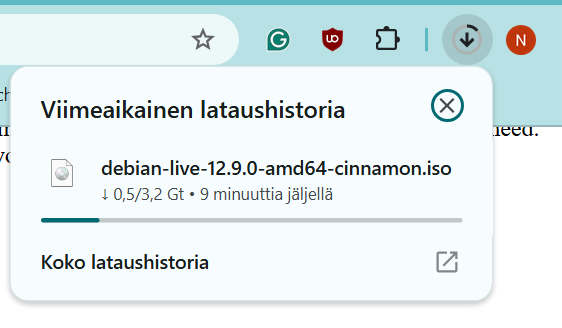

# Oma Linux

## x) Muistiinpanot

### Raportin kirjoittaminen -muistiinpanot

### Hyvä pohja raportille
- Raportoidaan täsmällisesti, mitä tehtiin ja mitä tapahtui.
- Kirjoitetaan raporttia reaaliaikaisesti tehtävien aikana.
- Pidetään muistiinpanoja jatkuvasti ajatusten selkeyttämiseksi ja ajan säästämiseksi.
- Käytetään raportteja pohjana ohjeiden laatimisessa.

### Raportin oltava toistettava
- Dokumentoidaan tehtävät ja ympäristö niin, että sama tulos voidaan saavuttaa uudelleen.
- Raportoidaan ympäristö: ajankohta, paikka, käytetyt laitteet ja muut olennaiset tiedot.

### Raportin oltava täsmällinen
- Kirjataan tarkasti, mitä komentoja käytettiin ja mitä toimenpiteitä tehtiin.
- Merkitään kellonajat työvaiheille ja raportoidaan odottamattomat tulokset.
- Raportoidaan onnistumiset ja epäonnistumiset sekä miten ne todettiin.
- Käytetään mennyttä aikamuotoa, esimerkiksi “valitsin ‘tyhjennä’”.

### Raportin oltava helppolukuinen
- Käytetään väliotsikoita ja huolehditaan oikeinkirjoituksesta.
- Sovitetaan kirjoitustyyli julkaisukanavaan.
- Halutessa lisätään lyhyt tiivistelmä raportin alkuun.

### Raportissa viitattava lähteisiin
- Käytetään viittauksia akateemisten käytäntöjen mukaisesti.
- Ilmoitetaan kirjoittajat, päivämäärät ja lähteiden osoitteet.
- Vakiotekstejä

### Lisätään tarvittaessa lisenssiteksti, esimerkiksi:
- “Tätä dokumenttia saa kopioida ja muokata GNU General Public License (versio 2 tai uudempi) mukaisesti.”
- Käytetään GPL-lisenssiä, jos lisenssi valitaan.

### Pahoja mokia
- Raportoidaan vain oikeasti tehdyt testit – ei sepitetä.
- Ilmoitetaan aina lähteet – ei plagioida.
- Käytetään vain luvallisia kuvia ja ilmoitetaan niiden lähteet.

### Free Software Foundation -muistiinpanot

### Free Software tarkoitus ja määritelmä
- Ohjelmisto, joka kunnioittaa käyttäjän vapautta ja yhteisöä.
- Käyttäjillä on vapaus käyttää, kopioida, jakaa, tutkia, muuttaa ja parantaa ohjelmistoa.
- Ohjelmistosta voi maksaa tai voi saada sen ilmaiseksi, mutta sen täytyy säilyttää käyttäjien vapaudet.
- Määritelmä perustuu neljään keskeiseen vapauteen: käyttää, tutkia, jakaa ja muokata ohjelmistoa.

### Neljä olennaista vapautta
- Vapaus 0: Vapaus käyttää ohjelmistoa haluamallasi tavalla.
- Vapaus 1: Vapaus tutkia ja muokata ohjelmistoa.
- Vapaus 2: Vapaus jakaa kopioita.
- Vapaus 3: Vapaus jakaa muutettuja versioita

### Copyleft ja sen merkitys
- Copyleft suojaa vapautta varmistamalla, ettei ohjelmistoa ja sen muutoksia rajoiteta.
- Copyleft varmistaa, että ohjelmistoa ja sen muutoksia voi jakaa ja muokata vapaasti.

### Vienti ja oikeudelliset näkökohdat
- Vapaan ohjelmiston lisenssi ei saa estää ohjelmiston jakamista tai käyttöä kansainvälisesti vientirajoitusten takia.
- Vapauksien on oltava pysyviä ja peruuttamattomia ilman syytä.
- Lisenssin ei tule sallia kehittäjien peruuttaa vapauksia ilman käyttäjän virheitä.

### Sopimusperusteiset lisenssit ja käytännön näkökohdat
- Sopimusperusteiset lisenssit voivat rajoittaa enemmän kuin tekijänoikeusperusteiset.
- Sopimuksissa voidaan asettaa lisärajoituksia, jotka tekevät ohjelmistosta ei-vapaan.
- Vapaan ohjelmiston määritelmä perustuu neljään vapauteen, ja lisenssejä arvioidaan niiden perusteella.

## a) Linuxin asennus virtuaalikoneeseen

### Ympäristötiedot:
Host-OS: Windows 11 Pro, 64-bittinen (versio 23H2, koontiversio 22631.4751)
Virtuaalikoneohjelmisto: Oracle VM VirtualBox (versio: ___)

Virtuaalikoneen asetukset:
Määrätty muistimäärä: 4096 MB (4 GB)
Prosessoreiden määrä: 2
Virtuaalinen kiintolevy: 20 GB, VDI (dynaaminen allokointi)

Käytettävä Linux-jakelu: Debian 12
Latasin ISO-tiedoston [täältä]:(https://cdimage.debian.org/debian-cd/current-live/amd64/iso-hybrid/)

 

