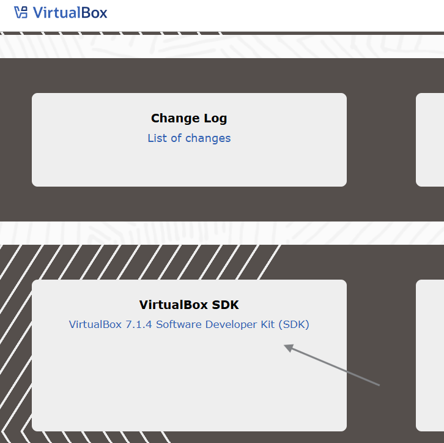
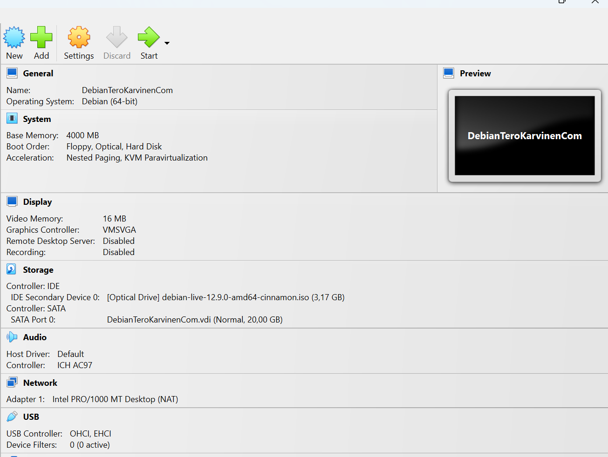
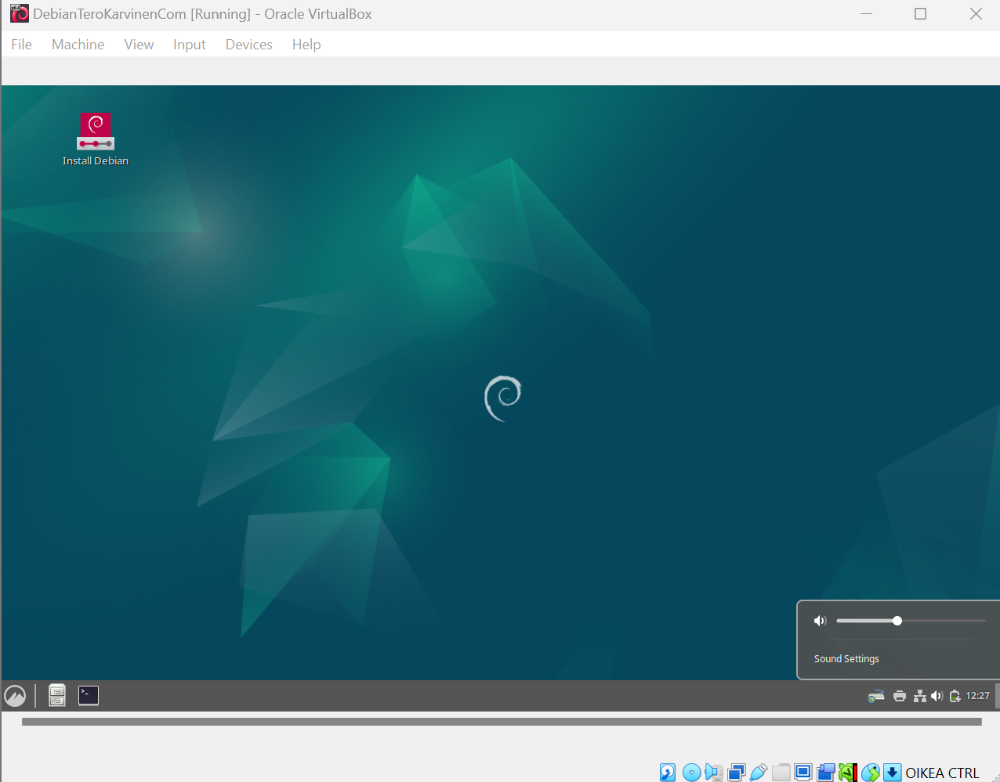
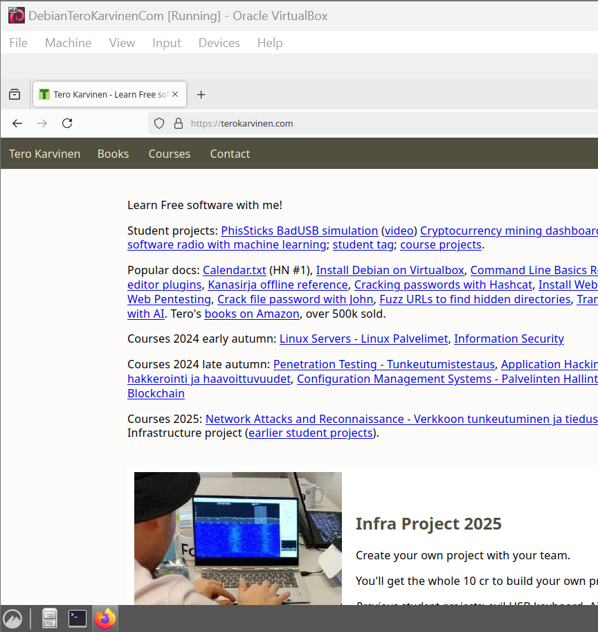
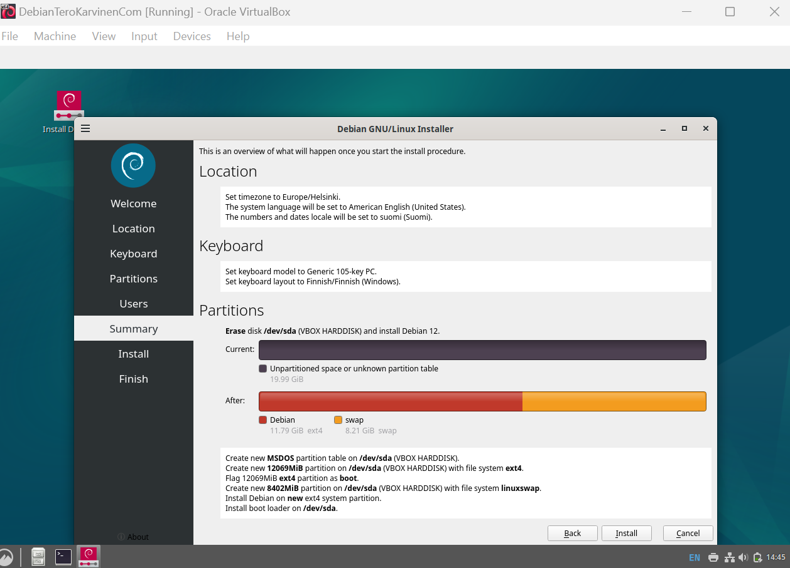

# X) Raportin kirjoittaminen -muistiinpanot

### Hyvä pohja raportille
- Raportoidaan täsmällisesti, mitä tehtiin ja mitä tapahtui.
- Kirjoitetaan raporttia reaaliaikaisesti tehtävien aikana.
- Pidetään muistiinpanoja jatkuvasti ajatusten selkeyttämiseksi ja ajan säästämiseksi.
- Käytetään raportteja pohjana ohjeiden laatimisessa.

### Raportin oltava toistettava
- Dokumentoidaan tehtävät ja ympäristö niin, että sama tulos voidaan saavuttaa uudelleen.
- Raportoidaan ympäristö: ajankohta, paikka, käytetyt laitteet ja muut olennaiset tiedot.

### Raportin oltava täsmällinen
- Kirjataan tarkasti, mitä komentoja käytettiin ja mitä toimenpiteitä tehtiin.
- Merkitään kellonajat työvaiheille ja raportoidaan odottamattomat tulokset.
- Raportoidaan onnistumiset ja epäonnistumiset sekä miten ne todettiin.
- Käytetään mennyttä aikamuotoa, esimerkiksi “valitsin ‘tyhjennä’”.

### Raportin oltava helppolukuinen
- Käytetään väliotsikoita ja huolehditaan oikeinkirjoituksesta.
- Sovitetaan kirjoitustyyli julkaisukanavaan.
- Halutessa lisätään lyhyt tiivistelmä raportin alkuun.

### Raportissa viitattava lähteisiin
- Käytetään viittauksia akateemisten käytäntöjen mukaisesti.
- Ilmoitetaan kirjoittajat, päivämäärät ja lähteiden osoitteet.
- Vakiotekstejä

### Lisätään tarvittaessa lisenssiteksti, esimerkiksi:
- “Tätä dokumenttia saa kopioida ja muokata GNU General Public License (versio 2 tai uudempi) mukaisesti.”
- Käytetään GPL-lisenssiä, jos lisenssi valitaan.

### Pahoja mokia
- Raportoidaan vain oikeasti tehdyt testit – ei sepitetä.
- Ilmoitetaan aina lähteet – ei plagioida.
- Käytetään vain luvallisia kuvia ja ilmoitetaan niiden lähteet.

### Free Software Foundation -muistiinpanot

### Free Software tarkoitus ja määritelmä
- Ohjelmisto, joka kunnioittaa käyttäjän vapautta ja yhteisöä.
- Käyttäjillä on vapaus käyttää, kopioida, jakaa, tutkia, muuttaa ja parantaa ohjelmistoa.
- Ohjelmistosta voi maksaa tai voi saada sen ilmaiseksi, mutta sen täytyy säilyttää käyttäjien vapaudet.
- Määritelmä perustuu neljään keskeiseen vapauteen: käyttää, tutkia, jakaa ja muokata ohjelmistoa.

### Neljä olennaista vapautta
- Vapaus 0: Vapaus käyttää ohjelmistoa haluamallasi tavalla.
- Vapaus 1: Vapaus tutkia ja muokata ohjelmistoa.
- Vapaus 2: Vapaus jakaa kopioita.
- Vapaus 3: Vapaus jakaa muutettuja versioita

### Copyleft ja sen merkitys
- Copyleft suojaa vapautta varmistamalla, ettei ohjelmistoa ja sen muutoksia rajoiteta.
- Copyleft varmistaa, että ohjelmistoa ja sen muutoksia voi jakaa ja muokata vapaasti.

### Vienti ja oikeudelliset näkökohdat
- Vapaan ohjelmiston lisenssi ei saa estää ohjelmiston jakamista tai käyttöä kansainvälisesti vientirajoitusten takia.
- Vapauksien on oltava pysyviä ja peruuttamattomia ilman syytä.
- Lisenssin ei tule sallia kehittäjien peruuttaa vapauksia ilman käyttäjän virheitä.

### Sopimusperusteiset lisenssit ja käytännön näkökohdat
- Sopimusperusteiset lisenssit voivat rajoittaa enemmän kuin tekijänoikeusperusteiset.
- Sopimuksissa voidaan asettaa lisärajoituksia, jotka tekevät ohjelmistosta ei-vapaan.
- Vapaan ohjelmiston määritelmä perustuu neljään vapauteen, ja lisenssejä arvioidaan niiden perusteella.

---

Lähteet:

https://terokarvinen.com/2006/raportin-kirjoittaminen-4/

---

# a) Linuxin asennus virtuaalikoneeseen

### Ympäristötiedot:
Asensin virtuaalikoneen ASUS-kannettavalleni, jossa on Windows 11 Pro (64-bittinen, versio 23H2, koontiversio 22631.4751) ja virtuaalikoneohjelmistona Oracle VM VirtualBox. Alla kerron tarkemmin vaihe vaiheelta, miten tämän tein.

Latasin ensin ISO-tiedoston, joka löytyy [täältä](https://cdimage.debian.org/debian-cd/current-live/amd64/iso-hybrid/) 

Seuraavaksi latasin Virtual Boxin: 

Loin uuden virtuaalikoneen VirtualBoxissa, valitsin "Skip Unattended Install", asetukseksi Linux, version Debian (64-bit), varasin 4000 MB muistia ja loin virtuaalisen kiintolevyn.

Opettajan ohjeissa kohta, "Create Virtual hard disk" aiheutti minulle hieman harmaita hiuksia, kun tehtävänannossa lukee, että tiedoston koon pitäisi olla 60GB, mutta kuvankaappauksessa näkyi 20.00GB. Valitsin virtuaalisen kovalevyn jo virtuaalikoneen luontivaiheessa, eikä siinä pitänyt erikseen määritellä mitään kokoja yms. Tarkistin, että tiedoston kokoni on 20.00GB, kuten opettajan kuvankaappauksessa, joten en muuttanut sitä enää. 

Seuraavaksi käynnistin virtuaalikoneen, ja sen jälkeen työpöytä avautui.

Testasin, että verkkoyhteys, hiiri, näppäimistö ja muut laitteet toimivat oikein. Käytin Firefox-selainta ja hain terokarvinen.com-sivustoa varmistaakseni, että kaikki toimi odotetusti.

Seuraavaksi käynnistin Debianin asennuksen virtuaalikoneessa. 

Seuraavaksi kirjauduin aiemmin asennuksessa luomillani tunnuksilla sisään ja testasin Firefoxilla, että netti toimii. Sitten avasin terminaalin, päivitin saatavilla olevan ohjelmiston luettelon, suoritin järjestelmäpäivityksen, asensin palomuurin ja käynnistin koneen uudelleen.

Lopuksi tutustuin Applications -menuun ja selailin TeroKarvinen.com-.

 

