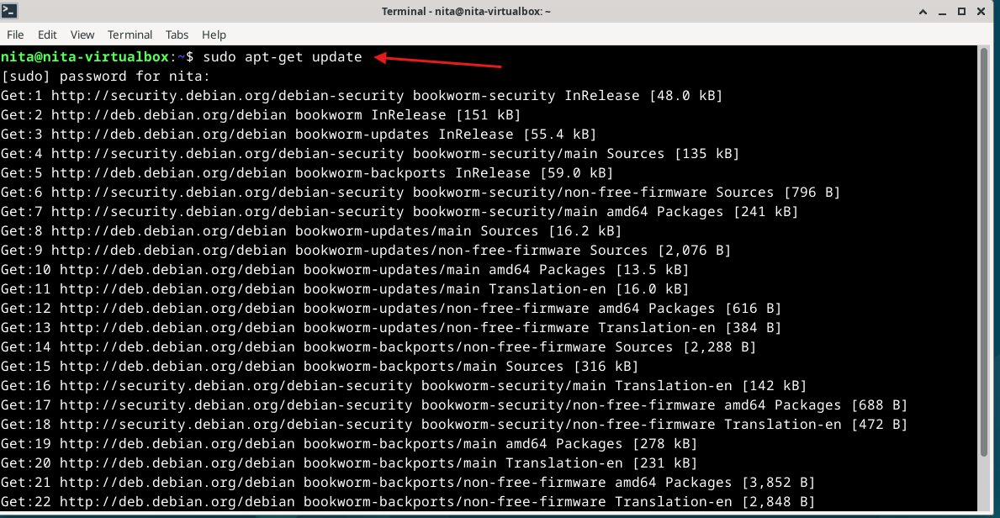
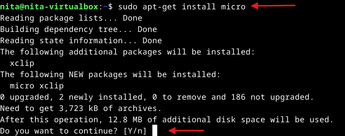
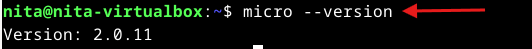
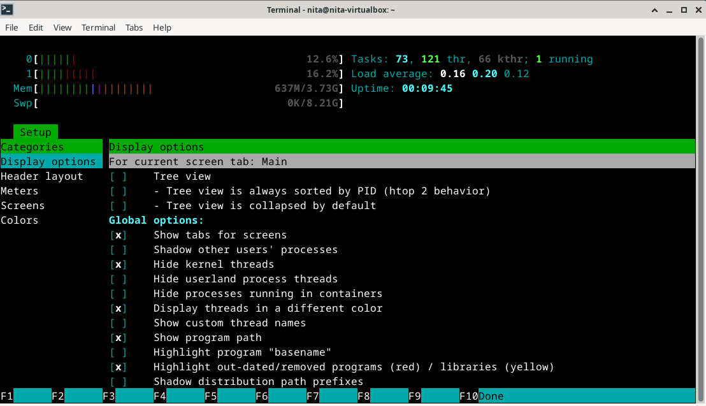
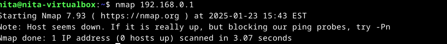
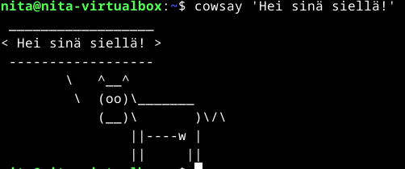

# H2 

## x) Komennot Linuxissa: Koska klikkaaminen on vain liian helppoa

### Komennot liikkumista varten
**pwd (Print working directory)**: Näyttää nykyisen työhakemiston, eli kertoo, missä hakemistossa työskennellään sillä hetkellä.

**ls (List)**: Näyttää ne tiedostot ja kansiot siinä hakemistossa, jossa ollaan sillä hetkellä. Tätä komentoa voi käyttää, jos esimerkiksi etsii tiedostoa ja saa "No such file or directory" -virheen, sillä silloin voi tarkistaa, onko sellaista tiedostoa edes olemassa. 

**cd (Change Directory)**: Auttaa siirtymään kansiosta toiseen. Jos komennon perään ei lisätä tietoa kansiosta tai tiedostosta, johon halutaan siirtyä (esim. cd kissakansio), komento vie automaattisesti käyttäjän kotikansioon.

**less**: Näyttää tiedoston sisällön ruutuun pienemmissä osissa. Tämä komento on hyödyllinen suurten tekstitiedostojen käsittelyssä, koska se ei lataa koko tiedostoa kerralla, vaan käsittelee sen sivu kerrallaan. Komento sisältää interaktiivisia ominaisuuksia, jotka mahdollistavat tiedoston selaamisen eteen- ja taaksepäin.

### Komennot tiedostojen muokkausta varten
**nano**: komentorivipohjainen tekstieditori, joka on suunniteltu konfiguraatiotiedostojen, skriptien ja muiden tekstipohjaisten asiakirjojen muokkaamiseen. 

**mkdir (Make directory)**: Luodaan uusi kansio (hakemisto).

**mv (Move)**: Siirretään tai nimetään tiedostoja ja kansioita. Ensimmäinen argumentti komennon jälkeen on tiedosto tai kansio, jota halutaan siirtää tai nimetä. Jos toisen argumentin perässä on kansio, tiedosto siirretään sinne. Jos toisen argumentin perässä on uusi tiedostonimi, tiedosto tai kansio nimetään uudelleen.

**cp (Copy)**: Kopioidaan tiedostoja ja kansioita. Jos komennon perään lisätään -r (rekursiivinen), kopioidaan myös kansion sisältö alihakemistoineen ja tiedostoineen. Esimerkiksi komento $ cp -r ORIGINAL COPY kopioi ORIGINAL-kansion (ja sen sisällön) COPY-kansioon.

**rmdir (Remove directory)**: Poistaa tyhjän hakemiston.

**rm (Remove)**: Poistaa tiedostoja, kansioita ja linkkejä tiedostojärjestelmästä, mutta ei poista kansioita ilman -r-optiota, ja poistetut tiedostot eivät ole palautettavissa.

### SHH etähallinta
**shh (Secure Shell Protocol)**: Käytetään turvalliseen etäyhteyteen toiseen tietokoneeseen tai palvelimeen. Se mahdollistaa tiedostojen siirron ja komentoja suorittamisen etänä salaamalla yhteyden. Omalle koneelle voidaan palata komennolla "exit".

**scp (Secure Copy)**: Kopioidaan tiedostoja tai kansioita turvallisesti omalta koneelta etäkoneelle tai toisinpäin SSH-yhteyden kautta.

### Komentohistorian hyödyntäminen
**Tabulaattori-näppäin**: Täydentää tiedostojen ja kansioiden nimet osan perusteella, jonka käyttäjä on kirjoittanut, ja etsii kaikki vaihtoehdot, jotka alkavat samalla tekstillä. Jos vain yksi vaihtoehto löytyy, se täyttyy automaattisesti.

**Nuoli ylös-näppäin**: Näyttää edellisen komennon.

**Vasen ja oikea nuolinäppäin**: Siirtävät kursoria vasemmalle tai oikealle kirjoitettaessa komentoa.

**Ctrl + R**: Etsii ja näyttää aiemmin suoritetut komennot kommentohistoriasta.

### Tärkeät hakemistot
**/**: Juurikansio

**/home/**: Sisältää kaikkien käyttäjien kotihakemistot. Esimerkiksi /home/tero/ on käyttäjän "tero" kotihakemisto. Ainoa paikka, johon käyttäjä "tero" voi tallentaa pysyvästi tietoja.

**/etc/**: Kaikki järjestelmän laajuiset asetukset. 

**/var/log/**: Järjestelmän laajuiset lokit.

**/media/**: Näkyvät irrotettavat laitteet, kuten USB-muistitikut ja CD-levyt, kun ne liitetään tietokoneeseen.

### Hallintakomennot
**sudo (Super user do!)**: Antaa käyttäjälle tilapäisen järjestelmänvalvojan oikeudet komentojen suorittamiseen.

**sudo apt-get update**: päivittää saatavilla olevien pakettien luettelon.

**apt-cache search**: Etsii ohjelmistoa avainsanojen perusteella ilman, että sudo-oikeuksia tarvitaan.

Lähteet:

Geeksforgeeks, 2025a. Luettavissa: https://www.geeksforgeeks.org/cd-command-in-linux-with-examples/. Luettu: 23.1.2025.

Geeksforgeeks. 2024b. Luettavissa: https://www.geeksforgeeks.org/rm-command-linux-examples/. Luettu: 23.1.2025. 

Jkorpela. s.a. Luettavissa: https://jkorpela.fi/unix/7.4.html. Luettu: 23.1.2025. 

Layton. 2023. Luettavissa: https://www.pluralsight.com/resources/blog/cloud/linux-commands-for-beginners-sudo. Luettu: 23.1.2025. 

Penmetsa. 2024. Luettavissa: https://medium.com/itversity/mastering-the-mv-command-6c5cb49d005d. Luettu: 23.1.2025. 

Phoenixnap, 2022a. Luettavissa: https://phoenixnap.com/kb/less-command-in-linux. Luettu 23.1.2025. 

Phoenixnap. 2024b. Luettavissa: https://phoenixnap.com/kb/use-nano-text-editor-commands-linux. Luettu: 23.1.2025.

SHH.com. s.aa. Luettavissa: https://www.ssh.com/academy/ssh/command#ssh-command-in-linux. Luettu: 23.1.2025. 

SHH.com. s.ab. Luettavissa: https://www.ssh.com/academy/ssh/scp. Luettu: 23.1.2025.

Terokarvinen, s.a. Luettavissa: https://terokarvinen.com/2020/command-line-basics-revisited/?fromSearch=command%20line%20basics%20revisited. Luettu: 23.1.2025.

### a) Micro editorin asennus
Asensin micro-editorin avaamalla virtuaalikoneeni ja siirtymällä terminaaliin. Suoritin ensin komennon sudo apt-get update, jolla päivitin pakettien luettelon:

Seuraavaksi asensin micro-editorin suorittamalla komennon sudo apt-get install micro ja vahvistamalla asennuksen painamalla näppäimistöstä y-kirjainta.

Seuraavaksi tarkistin, että micro on asennettu oikein komennolla micro --version.

### b) Kolmen uuden komentoriviohjelman asennus ja testaus
Asensin kolme valitsemaani komentoriviohjelmaa: htop, nmap sekä cowsay. Käytin niiden asentamiseen yhtä komentoa: sudo apt-get update && sudo apt-get install -y htop nmap cowsay. 

Htop on komentorivityökalu, joka tarjoaa interaktiivisen ja värillisen näkymän järjestelmän resursseista ja prosesseista reaaliajassa. Testasin sitä kirjoittamalla komentoriville htop.

Nmap:ia käytetään verkon tutkimiseen ja tietoturva-auditointeihin tarjoamalla reaaliaikaista tietoa verkosta, aktiivisista IP-osoitteista, avoimista porteista, live-isännistä sekä suorittamalla portti-, käyttöjärjestelmä- ja isäntäskannauksia. Tein testauksen kirjoittamalla komentoriville "nmap" ja käyttämällä yleisesti käytettyä IP-osoitetta 192.168.0.1.

Cowsay-komento luo tekstipohjaisen hahmon, joka "puhuu" syötetyn tekstin puhekuplassa. Kokeilin komentoa kirjoittamalla ensin "cowsay" komentoriville ja sen jälkeen syöttämällä tekstiksi 'Hei sinä siellä!'.

Lähteet: 

Geeksforgeeks. 2024a. Luettavissa: https://www.geeksforgeeks.org/htop-command-in-linux-with-examples/. Luettu: 23.1.2025. 

Geeksforgeeks. 2024b. Luettavissa: https://www.geeksforgeeks.org/nmap-command-in-linux-with-examples/. Luettu: 23.1.2025.

Ioflood. 2023. Luettavissa: https://ioflood.com/blog/cowsay-linux-command/. Luettu: 23.1.2025. 

