# x) Name-based Virtual Host Support -kirjoituksen tiivistelmä

**Nimipohjaiset vs. IP-osoitteisiin perustuvat virtuaali-isännöinnit**
- Nimipohjaisessa virtuaaliisännöinnissä useat isännät voivat jakaa saman IP-osoitteen, koska palvelin tunnistaa isännän HTTP-otsikon perusteella.
- Ip-pohjaisessa virtuaaliisännöinnissä jokaiselle isännälle tarvitaan oma IP-osoite, koska palvelin tunnistaa oikean isännän IP-osoitteen perusteella.
- Nimipohjainen isännonti on suositeltavampi, koska se vähentää IP-osoitteiden tarvetta ja on helpompi konfiguroida, ellei laitteisto vaadi erikseen IP-pohjaista isännöintiä. 

**Miten palvelin valitsee oikean nimipohjaisen virtuaali-isännän?**
- IP-pohjainen resoluutio on ensimmäinen vaihe, jossa palvelin valitsee oikean virtuaali-isännän sen IP-osoitteen ja portin perusteella.
- Wildcard (*) merkin käyttö IP-osoitteessa mahdollistaa nimipohjaisen isännöinnin. Tämä tarkoittaa, että ei tarvitse määrittää erillisiä IP-osoitteita jokaiselle verkkosivustolle, vaan palvelin osaa erottaa ne toisistaan verkkosivustojen domainien perusteella, jolloin useat sivustot voivat jakaa saman IP-osoitteen.
- Kun palvelimelle tulee pyyntö, se valitsee oikean virtuaali-isännän sen perusteella, mikä IP-osoite ja portti on käytetty. Jos on useita mahdollisia osumia, palvelin tarkistaa vielä, että pyynnön palvelinnimi vastaa isännän määritettyjä nimiä (ServerName ja ServerAlias).
- Jos ServerName-määritys jätetään pois nimipohjaisesta virtuaali-isännästä, palvelin käyttää automaattisesti järjestelmän isäntänimeä (FQDN), mikä voi johtaa odottamattomiin tuloksiin.
- Jos mikään ServerName tai ServerAlias ei vastaa parhaiten soveltuvaa IP-osoitetta ja porttia, käytetään ensimmäistä virtuaali-isäntää, joka täsmää.

**Nimipohjaisen virtuaali-isännöinnin käyttäminen**
- Virtuaaliisännöinnissä luodaan <VirtualHost> lohko, jossa määritellään ServerName (verkkosivuston tai domainin nimi, esim. www.esimerkki.com) ja DocumentRoot (polku, jossa verkkosivuston tiedostot sijaitsevat, kuten HTML-sivut ja kuvat).
- Jos pyyntö ei löydä oikeaa virtuaali-isäntää, palvelin käyttää perusasetuksia, mutta name-based virtuaali-isännän lisääminen mahdollistaa useiden verkkosivustojen käsittelyn samalla IP:llä ja portilla, ja oletusvirtuaali-isäntä varmistaa, että kaikki muu liikenne ohjataan oikeaan paikkaan.
- Paras tapa on määrittää aina ServerName itse, koska ilman sitä palvelin perii sen perusasetuksista, mikä voi vaikuttaa virtuaali-isäntien toimintaan.
- Voidaan myös valita käyttää tiettyä IP-osoitetta, sen sijaan, että käytetään wildcard -merkkiä <VirtualHost> -määrityksessä.
- Jos halutaan, että samalle verkkosivustolle pääsee eri nimillä, voidaan käyttää ServerAlias määritystä.
- Nimipohjaiset virtuaali-isännät käsitellään siinä järjestyksessä, missä ne on kirjoitettu konfiguraatiotiedostoon. Apache valitsee ensimmäisen, joka sopii pyynnön isäntänimeen. Wildcard-merkeillä ei ole erityistä etusijaa.
- Virtuaali-isäntien asetuksia voi muokata lisäämällä direktiivejä <VirtualHost>-lohkoihin. Näin voi muuttaa vain kyseisen isännän asetuksia, ellei niitä ole ohitettu muilla asetuksilla.

---
**Lähteet**

https://httpd.apache.org/docs/2.4/vhosts/name-based.html

---
# x) Name Based Virtual Hosts on Apache – Multiple Websites to Single IP Address -kirjoituksen tiivistelmä
Alla lyhyt luettelo komennoista ja konfiguraatiotiedostoista, jotka on koottu Name Based Virtual Hosts on Apache – Multiple Websites to Single IP Address -kirjoituksesta.

Web-palvelimen asennus ja oletusverkkosivuston korvaus = 

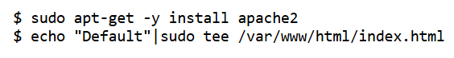

Uuden nimipohjaisen virtuaali-isännän asennus = 

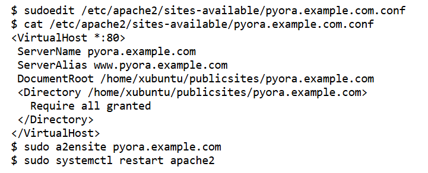

Verkkosivuston luominen tavallisena käyttäjänä = 

---
**Lähteet**

https://terokarvinen.com/2018/04/10/name-based-virtual-hosts-on-apache-multiple-websites-to-single-ip-address/

---

# a) Web-palvelimen testausta

Aloitin testaamalla Apache-palvelimen tilan terminaalissa komennolla systemctl status apache2. Palvelimen käynnissäolon voi nähdä riviltä Active, jossa lukee active (running), mikäli palvelin on päällä.

Seuraavaksi testasin, että web-palvelin vastaa localhost-osoitteesta. Avasin Firefox-selaimen ja kirjoitin osoiteriville http://localhost, joka johti Apache-verkkopalvelimen oletussivulle.

Testasin toimivuutta myös komentoriviltä komennolla curl http://localhost, joka palautti saman oletussivun sisällön.

---
**Lähteet**

ChatGPT. (2025). Keskustelu palvelimen testauksesta [Vastaus promptiin: "Kerro vaiheittain, miten voin testata palvelintani virtuaalikoneeni terminaalissa?" ja "Mikä rivi kertoo, että palvelin on päällä"?]. OpenAI. Haettu 2. helmikuuta 2025.

---

# b) Lokien analysointia

Esittelen seuraavaksi Apache2:n access.log-tiedostossa olevia rivejä, jotka liittyvät palvelimelle tehtyyn curl localhost -pyyntöön. 

Ensimmäisessä lokirivissä näkyy pyyntö, joka on tehty IP-osoitteesta 10.0.2.15. Kyseessä on GET-pyyntö, joka on tehty pääsivulle (/), ja palvelin on vastannut onnistuneesti tilakoodilla 200. Pyyntö tehtiin 28. tammikuuta 2025 kello 10:58:54 aikavyöhykkeellä -0500 (Olen unohtanut määrittää virtuaalikoneelleni oikean päivämäärän ja kellonajan. Vastaus oli 3380 tavua, eikä referrer-tietoja ollut saatavilla, mikä merkitään miinuksella. User-Agent- kenttä kertoo, että pyyntö on tehty Firefoxin version 128.0 avulla Linux-käyttöjärjestelmässä.

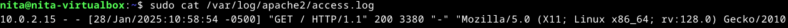

Ohessa vielä kaikki access.log -tiedostossa olevat rivit.

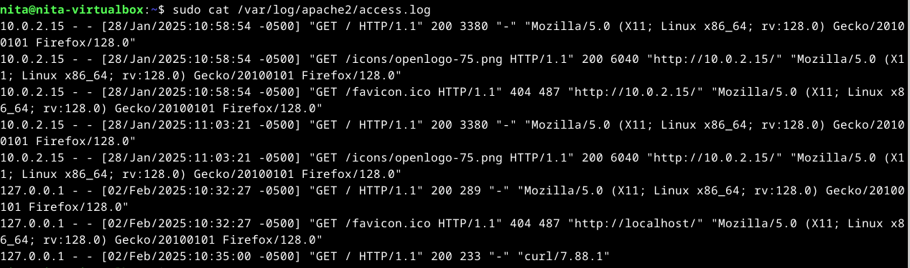

---

**Lähteet**

https://www.sumologic.com/blog/apache-access-log/

https://www.loggly.com/use-cases/how-to-monitor-your-apache-logs/

---

# c) Etusivu uusiksi

Tässä tehtävässä tein uuden name-based virtual hostin Apache2:lle, joka ohjasi pyynnöt hattu.example.com-verkkotunnukseen. Tavoitteena oli, että tämä sivu näkyisi suoraan palvelimen etusivuna (http://localhost/), ja että sivua pystyi muokkaamaan normaalina käyttäjänä ilman sudo-oikeuksia.

Minulla oli paljon haasteita tehtävän tekemisessä, joten aloitin sitä monta kertaa alusta. Viimeisimmällä kerralla käytin ensin komentoa sudo a2dissite 000-default poistamaan käytöstä Apache-verkkopalvelimen oletussivuston (000-default.conf). Kuten kuvankaappauksessa näkyy, niin se oli jo valmiiksi pois käytöstä (varmaan sen takia, koska olen tehnyt tämän monta kertaa jo). Sitten tein taas konfiguraatiotiedoston komennolla sudo nano /etc/apache2/sites-available/hattu.example.com.conf. Koska olin jo aikaisemmin tehnyt tämän, niin minulle aukesi aikaisemmin luomani konfiguraatiotiedosto. 

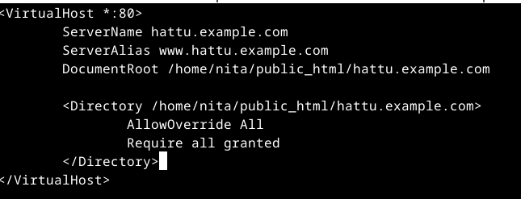

Seuraavaksi loin hakemiston ja asetin oikeudet normaalille käyttäjälle komennolla sudo chown -R kayttaja:kayttaja /home/kayttaja/hattu. Sitten otin uuden sivuston käyttöön ja poistin vanhan komennolla sudo a2ensite hattu.example.com, sudo a2dissite 000-default ja lopuksi sudo systemctl restart apache2. 

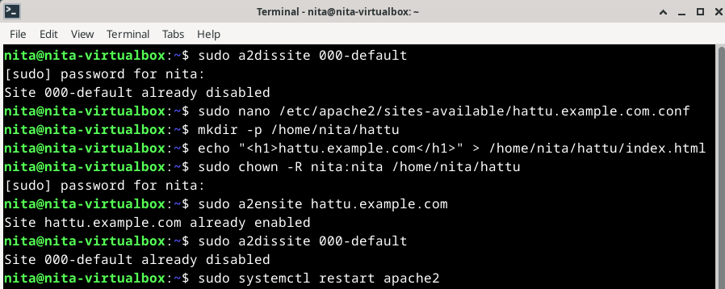

Koitin taas testata selaimessa, mutta ei toiminut.

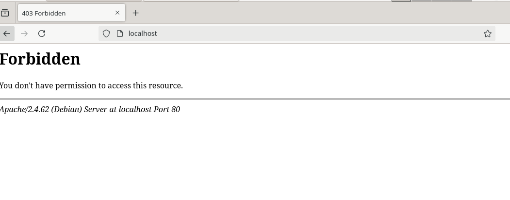

Mikä avuksi?

**Päivitetty 6.2.**

Aloitin tutkimalla Apache2:n virhelokia komennolla sudo tail 1 apache2/error. Komento palauttaa viimeisimmän rivin virhelokista. Komento palautti virheen "cannot open 'apache2/error' for reading: No such file or directory", joka on virheilmoitus, joka tarkoittaa, että tiedostoa ei ole olemassa.

Opettajan ohjeiden mukaisesti loin tarvittavat kansiot /home/nita/public_html ja /home/nita/public_html/hattu.example.com. Nämä kansiot tarvitaan, jotta Apache2 voi löytää sivuston tiedostot.

Loin oletussivun index.html kansioon /home/nita/public_html/hattu.example.com/. Lisäsin tiedostoon seuraavan sisällön:

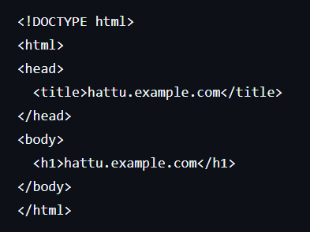

Kun olin luonut kansiot ja oletussivun, testasin sivustoa selaimessa. Nyt sivusto toimi odotetusti ja näytti "hattu.example.com"-sisällön.

---

**Lähteet**

ChatGPT. (2025). "Keskustelu Apache virtuaali-isännän luomisesta ja käyttäjäoikeuksien määrittämisestä [Vastaus promptiin: 'Miten luon virtuaali-isännän Apachelle, jotta etusivun voi muokata käyttäjä ilman sudo-oikeuksia?']." OpenAI. Haettu 2. helmikuuta 2025.

https://terokarvinen.com/2018/name-based-virtual-hosts-on-apache-multiple-websites-to-single-ip-address/?fromSearch=name%20based

Kurssin opettaja ja oppilaat

---

# Curlista lisää

curl on komentorivityökalu, jolla voidaan siirtää tietoja palvelimelta tai palvelimelle eri protokollien avulla, kuten HTTP, FTP ja SMTP.
curl -l suorittaa HTTP HEAD -pyynnön, joka palauttaa vain palvelimen vastauksen otsakkeet ilman varsinaista sisältöä.

Testasin curl komentoa Verkkokauppa.com:in sivuilla. Tuloksina näkyi Moved permanently, joka on HTTP-tilakoodi, joka kertoo, että pyydetty resurssi on siirretty pysyvästi uuteen URL-osoitteeseen.

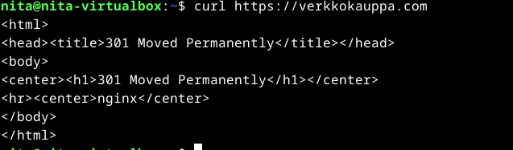

Tämän jälkeen kokeilin curl -l komennolla: 

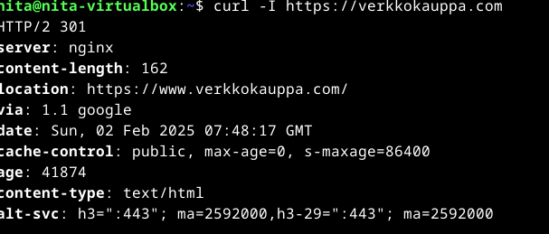

HTTP/2 301 tarkoittaa, että palvelin käyttää HTTP/2-protokollaa ja palauttaa tilakoodin 301. Tämä koodi kertoo, että sivu on pysyvästi siirretty uuteen osoitteeseen, ja se ohjaa minut automaattisesti sinne. Rivillä "Server: nginx" näkyy, että käytetty web-palvelin on nginx. "Content-length: 162" tarkoittaa, että palvelimelta saamani HTML-vastaus on 162 tavua pitkä. Otsakkeessa "Location: https://www.verkkokauppa.com/" näen, että alkuperäinen URL-osoite on siirretty pysyvästi uuteen paikkaan, ja minun tulisi mennä https://www.verkkokauppa.com/ -sivulle. Rivillä "via: 1.1 google" huomaan, että pyyntöni on kulkenut Google-välimuistin kautta."Date: Sun, 02 Feb 2025 07:48:17 GMT" kertoo tarkalleen, milloin palvelin on vastannut pyyntöön, ja aikaleima on ilmoitettu GMT-aikavyöhykkeellä. "Cache-control: public, max-age=0, s-maxage=86400" tarkoittaa, että sisältö on välimuistitettavissa julkisesti, mutta se ei ole suositeltavaa pitää välimuistissa pitkään (max-age=0). Kuitenkin palvelin sallii välimuistin pitävän sitä voimassa 24 tuntia (s-maxage=86400 sekuntia). "Age: 41874" kertoo minulle, kuinka vanha välimuistissa oleva sisältö on. Tässä tapauksessa se on noin 41874 sekuntia vanha, eli noin 11 tuntia ja 40 minuuttia."Content-type: text/html" tarkoittaa, että vastaanottamani sisältö on HTML-muodossa."Alt-svc: h3=": 443"; ma=2592000, h3-29=": 443"; ma=2592000" kertoo minulle, että palvelin tukee vaihtoehtoisia protokollia, kuten HTTP/3 (h3), ja nämä vaihtoehdot ovat voimassa 30 päivän ajan (ma=2592000 sekuntia).

---
**Lähteet**

https://curl.se/docs/manpage.html

https://apidog.com/articles/curl-i-command/

ChatGPT. (2025). "Keskustelu curl-komennon käytöstä ja vastauksen otsakkeiden selittämisestä [Vastaus promptiin: 'Yksinkertainen curl -I ja curl -komennon testausohje']." OpenAI. Haettu 2. helmikuuta 2025.

---

# e) Validi HTML-sivu 

Tässä tehtävässä tein yksinkertaisen HTML5-sivun Debian Linux -virtuaalikoneessa käyttäen komentoriviä.

Aluksi loin uuden HTML-tiedoston nimeltä index.html komennolla nano index.html 

Sitten tallensin tiedoston nano-editorilla (Ctrl + O ja Ctrl + X).

Avasin sitten tiedoston selaimessa komennolla xdg-open index.html.

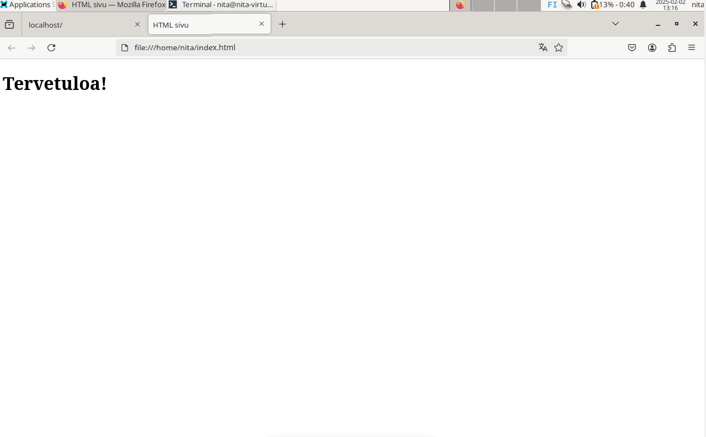

---

**Lähteet**

ChatGPT. (2025). "Keskustelu HTML5-sivun luomisesta [Vastaus promptiin: 'Ohjeet yksinkertaisen HTML5-sivun luontiin']." OpenAI. Haettu 2. helmikuuta 2025.

---

