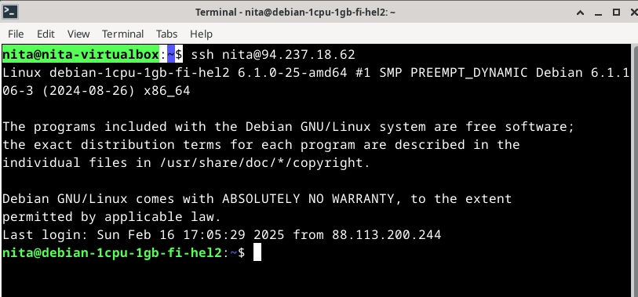

# x) Susanna Lehto 2022: Teoriasta käytäntöön pilvipalvelimen avulla -muistiinpanot

# x) Karvinen 2012: First Steps on a New Virtual Private Server – an Example on DigitalOcean and Ubuntu 16.04 LTS -muistiinpanot

# a) Virtuaalipalvelimen vuokraus ja käyttöönotto

Aluksi loin tilin Upcloudiin heidän [kirjautumissivuilta](https://signup.upcloud.com/). Sitten kirjauduin sisään vahvistamaan tili lisäämällä maksutiedot jne. 

Vuokrasin virtuaalipalvelimen Upcloudista ja valitsin siihen sopivan käyttöjärjestelmän ja resurssit. Käytin opettajan esimerkin mukaisia asetuksia, eli palvelimen sijainti oli Suomessa, suunnitelma 1 vCPU (10 GB tallennustilalla), käyttöjärjestelmäksi valitsin Debian GNU/Linux 12 (Bookworm), kirjautumiseen käytin SSH-avaimia ja muut asetukset jätin oletusasetuisiin. 

Ennen virtuaalipalvelimen asentamista, loin komentokehotteessa SSH-avaimet opettajan sivuilla olevien ohjeiden mukaan, jotka löytyvät [Vinkit-osiosta](https://terokarvinen.com/linux-palvelimet/#h4-maailma-kuulee), ja lisäsin avaimen kirjautumistavaksi palvelimen asetuksissa. Sen jälkeen minä asensin virtuaalipalvelimen.

 

 

 # b) Virtuaalipalvelimen peruskonfigurointi ja turvatoimet

 **Root-tunnus kiinni**

Poistin root-käyttäjän myös opettajan sivuilla olevien ohjeiden mukaan, jotka löytyvät [Vinkit-osiosta](https://terokarvinen.com/linux-palvelimet/#h4-maailma-kuulee). Root-käyttäjän poistaminen tai sen käytön rajoittaminen on hyvä tehdä turvallisuuden parantamiseksi, ja sillä voidaan estää suorituskykyisten hyökkäysten mahdollisuus ja parannetaan käyttäjien hallintaa.

Suoritettuani ohjeet, yritin kirjautua root-käyttäjälle komennolla ssh root@94.237.10.253, mutta sain virheilmoituksen, eli onnistuin sulkemaan root-käyttäjän SSH-yhteydet

 

 **Tulimuuri päälle**

Tässä tehtävässä hyödynsin opettajan antamia ohjeita 4.2. pidetyssä luennossa, jossa hän esitteli esimerkin tulimuurin käyttöönotosta. Aloitin päivittämällä järjestelmän komennolla sudo apt-get update. Tämän jälkeen asensin tulimuurin komennolla sudo apt-get install ufw.

 

Ensiksi avasin tarvittavat portit tulimuurissa. Käytin komentoa sudo ufw allow, ja sen jälkeen lisäsin portin 22/tcp komennolla sudo ufw allow 22/tcp, jotta SSH-yhteydet olivat mahdollisia. Mikäli tulimuurin laittaisi päälle ennen porttien sallimista, etäyhteys katkeaisi, koska yhteys ei pääsisi läpi.

Lopuksi aktivoitin tulimuurin komennolla sudo ufw enable, joka otti asetukset käyttöön.

 

 Tadaa!

**Ohjelmien päivitys**

Lopuksi päivitin ohjelmat komennoilla sudo apt-get update ja sen jälkeen ajoin komennon sudo apt-get upgrade. Ohjeet löytyivät [First Steps on a New Virtual Private Server – an Example on DigitalOcean and Ubuntu 16.04 LTS -artikkelista](https://terokarvinen.com/2017/first-steps-on-a-new-virtual-private-server-an-example-on-digitalocean/)

# c) Web-palvelimen asennus ja testisivun korvaaminen virtuaalipalvelimella

Aloitin tehtävän asentamalla apachen uudelle virtualipalvelimelle. Sen jälkeen testasin että webpalvelin toimii kirjoittamalla selaimeen http://92.237.10.253 (ostamani verkkopalvelimen ip osoite). 

 

Sitten poistin Apachen oletussivun komennolla sudo rm /var/www/html/index.html ja loin oman index.html tiedoston. Aloitin sen ensin siirtymällä Apachen juurihakemistoon komennolla cd /var/www/html/.

Päivitin selaimessa sivun, jossa olin aikaisemmin ja tällä kertaa aukesi minun juuri tekemäni testisivu.

Kokeilin myös, että näkyykö sivu kännykälläni ja sehän näkyi. 

