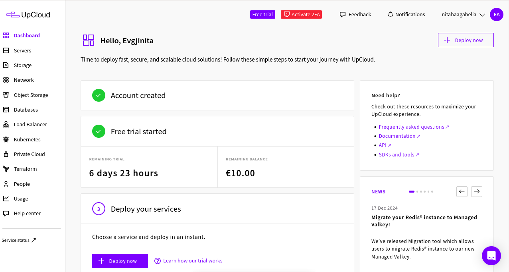
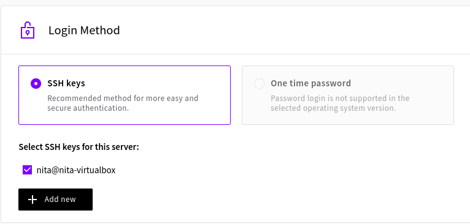
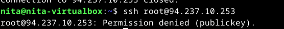
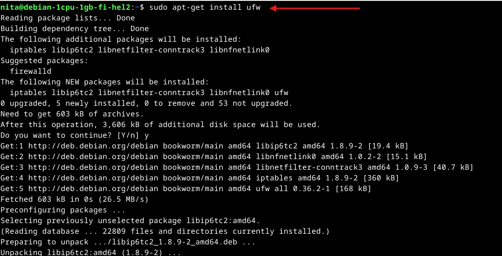
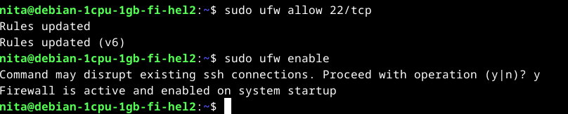
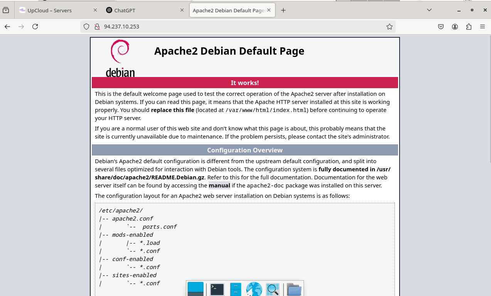
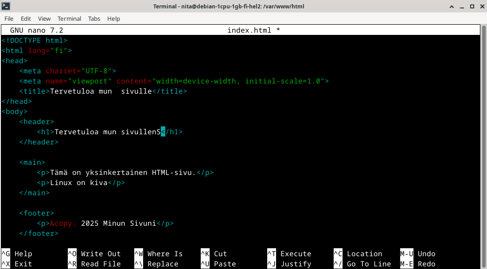
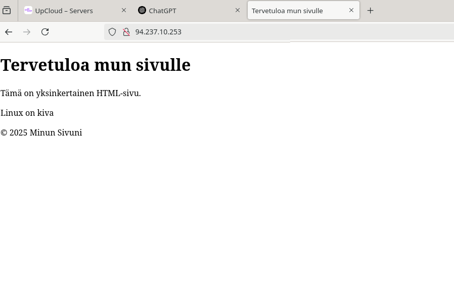
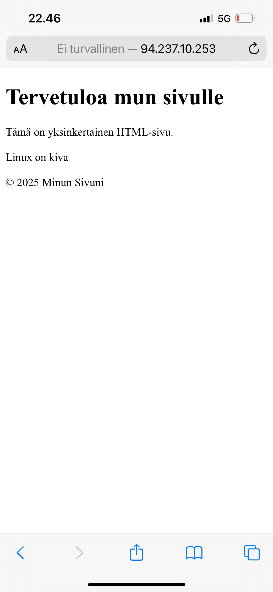

# x) Susanna Lehto 2022: Teoriasta käytäntöön pilvipalvelimen avulla -muistiinpanot

## Pilvipalvelimen vuokraus

- Palvelin vuokrataan esimerkiksi pilvipalveluntarjoajalta, kuten DigitalOceanilta, Namecheapiltä tai suomalaiselta UpCloudilta.
- Palvelimen valinnassa huomioitavia seikkoja: sijainti (mahdollisimman lähellä käyttäjiä), hinta, suorituskyky ja GDPR-vaatimukset.
- Palveluntarjoajat voivat vaatia maksutietojen ja henkilöllisyyden varmistamista (esim. pieni veloitus, joka palautetaan).
- Autentikointimenetelmänä kannattaa käyttää SSH-avaimia salasanan sijaan.

## Palvelin suojaa palomuurilla
<ins>Miksi palomuuri?</ins>
- Rajoittaa luvattomia yhteyksiä ja parantaa palvelimen turvallisuutta.

<ins>Yhteyden muodostaminen palvelimeen</ins>
- Yhdistetään palvelimeen SSH-yhteydellä käyttämällä palvelimen IP-osoitetta.
- Ensimmäisellä kerralla hyväksytään yhteys ja syötetään salasana.

<ins>Järjestelmän valmistelu</ins>
- Ennen uusien ohjelmistojen asennusta päivitetään järjestelmän pakettilista.

<ins>Palomuurin asentaminen ja käyttöönotto</ins>
- Asennetaan palomuuri (esim. UFW – Uncomplicated Firewall).
- Avataan tarvittavat portit, kuten SSH-yhteyden käyttämä portti.
- Palomuuri otetaan käyttöön ja varmistetaan, että sallitut yhteydet toimivat.

## Palvelimen ohjelmien päivitys
<ins>Palvelimen ohjelmien päivitys</ins>
- Ylläpito alkaa muodostamalla SSH-yhteys palvelimeen pääkäyttäjän tunnuksilla.
- Ensin haetaan tiedot saatavilla olevista päivityksistä.
- Asennetaan ohjelmapäivitykset ja tietoturvapäivitykset komentoja käyttäen.
- Päivitykset varmistavat, että järjestelmä pysyy turvallisena ja ajan tasalla.

<ins>Murtautumisyritysten havaitseminen lokeista</ins>
- Palvelimen lokitietoja voidaan tarkastella hakemalla tietoja autentikointilokista.
- Lokeista voi tunnistaa epäilyttäviä kirjautumisyrityksiä, esim. toistuvat virheelliset salasanayritykset.
- IP-osoitteita voidaan analysoida ulkoisilla palveluilla tunnistaakseen hyökkäysten alkuperän.
- Automaattiset bottihyökkäykset ovat yleisiä, mutta vahva salasana ja rajoitettu pääsy estävät murtautumisen.

# x) Karvinen 2012: First Steps on a New Virtual Private Server – an Example on DigitalOcean and Ubuntu 16.04 LTS -muistiinpanot

<ins>Palvelimen luominen</ins>

- Rekisteröidään tili ja luodaan uusi virtuaalipalvelin valitussa datakeskuksessa.
- Yhteys palvelimeen muodostetaan ensimmäisellä kirjautumiskerralla SSH:n kautta.

<ins>Palomuurin määrittäminen</ins>
- Ennen käyttöönottoa sallitaan SSH-yhteydet ja otetaan palomuuri käyttöön.

<ins>Käyttäjätunnuksen luominen</ins>
- Jokaiselle käyttäjälle oma tunnus, ei pelkästään pääkäyttäjän käyttöä.
- Luodaan uusi käyttäjä ja annetaan sille tarvittavat oikeudet.

<ins>Root-käyttäjän poistaminen käytöstä</ins>
- Root-tili lukitaan ja sen SSH-kirjautuminen estetään turvallisuussyistä.

<ins>Ohjelmistojen päivittäminen</ins>
- Kaikki paketit päivitetään, jotta vältetään vanhojen haavoittuvuuksien hyödyntäminen.

<ins>DNS-nimen lisääminen</ins>
- Julkinen IP voidaan korvata verkkotunnuksella helpompaa käyttöä varten.
- DNS-konfigurointi tehdään esimerkiksi NameCheap-palvelussa.

## Tehtävissä a) - c) käytetty ympäristö
Kannettava tietokone
MalliVivoBook_ASUSLaptop X421IA_M433IA
Suoritin: AMD Ryzen 7 4700U with Radeon Graphics
RAM: 8 Gt
SSD-levyn koko: 476,07 Gt, josta vapaata tilaa: 357,07 Gt
Järjestelmätyyppi: 64-bittinen käyttöjärjestelmä, x64-suoritin
Käyttöjärjestelmä: Windows 11 Home

Virtuaalikone
Virtualisointi: Oracle Virtualbox versio 7.1.0 r164728 (Qt6.5.3)
Muisti: 4000 MB
CPU: 2
Virtuaalikovalevyn koko: 20.00 GB
Käyttöjärjestelmä: Debian GNU/Linux 12 (bookworm)

# a) Virtuaalipalvelimen vuokraus ja käyttöönotto

Aluksi loin tilin Upcloudiin heidän [kirjautumissivuilta](https://signup.upcloud.com/). Sitten kirjauduin sisään vahvistamaan tili lisäämällä maksutiedot jne. 

Vuokrasin virtuaalipalvelimen Upcloudista ja valitsin siihen sopivan käyttöjärjestelmän ja resurssit. Käytin opettajan esimerkin mukaisia asetuksia, eli palvelimen sijainti oli Suomessa, suunnitelma 1 vCPU (10 GB tallennustilalla), käyttöjärjestelmäksi valitsin Debian GNU/Linux 12 (Bookworm), kirjautumiseen käytin SSH-avaimia ja muut asetukset jätin oletusasetuisiin. 

Ennen virtuaalipalvelimen asentamista, loin komentokehotteessa SSH-avaimet opettajan sivuilla olevien ohjeiden mukaan, jotka löytyvät [Vinkit-osiosta](https://terokarvinen.com/linux-palvelimet/#h4-maailma-kuulee), ja lisäsin avaimen kirjautumistavaksi palvelimen asetuksissa. Sen jälkeen minä asensin virtuaalipalvelimen.

 

 # b) Virtuaalipalvelimen peruskonfigurointi ja turvatoimet

 ## Root-tunnus kiinni

Poistin myös root-käyttäjän opettajan sivuilla olevien ohjeiden mukaan, jotka löytyvät [Vinkit-osiosta](https://terokarvinen.com/linux-palvelimet/#h4-maailma-kuulee). Root-käyttäjän poistaminen on hyvä tehdä turvallisuuden parantamiseksi.

Suoritettuani ohjeet, yritin kirjautua root-käyttäjälle komennolla ssh root@94.237.10.253, mutta sain virheilmoituksen, eli onnistuin sulkemaan root-käyttäjän SSH-yhteydet

 

 ## Tulimuuri päälle

Tässä tehtävässä hyödynsin opettajan antamia ohjeita 4.2. pidetyssä luennossa, jossa hän esitteli esimerkin tulimuurin käyttöönotosta. Aloitin päivittämällä järjestelmän komennolla sudo apt-get update. Tämän jälkeen asensin tulimuurin komennolla sudo apt-get install ufw.

 

Ensiksi avasin tarvittavat portit tulimuurissa. Käytin komentoa sudo ufw allow, ja sen jälkeen lisäsin portin 22/tcp komennolla sudo ufw allow 22/tcp, jotta SSH-yhteydet olivat mahdollisia. Mikäli tulimuurin laittaisi päälle ennen porttien sallimista, etäyhteys katkeaisi, koska yhteys ei pääsisi läpi.

Lopuksi aktivoitin tulimuurin komennolla sudo ufw enable, joka otti asetukset käyttöön.

 

 Tadaa!

## Ohjelmien päivitys

Lopuksi päivitin ohjelmat komennoilla sudo apt-get update ja sen jälkeen ajoin komennon sudo apt-get upgrade. Ohjeet löytyivät [First Steps on a New Virtual Private Server – an Example on DigitalOcean and Ubuntu 16.04 LTS -artikkelista](https://terokarvinen.com/2017/first-steps-on-a-new-virtual-private-server-an-example-on-digitalocean/)

# c) Web-palvelimen asennus ja testisivun korvaaminen virtuaalipalvelimella

Aloitin tehtävän asentamalla apachen uudelle virtualipalvelimelle. Sen jälkeen testasin että webpalvelin toimii kirjoittamalla selaimeen http://92.237.10.253 (ostamani verkkopalvelimen ip osoite). 

 

Sitten poistin Apachen oletussivun komennolla sudo rm /var/www/html/index.html ja loin oman index.html tiedoston. Aloitin sen ensin siirtymällä Apachen juurihakemistoon komennolla cd /var/www/html/.

Päivitin selaimessa sivun, jossa olin aikaisemmin ja tällä kertaa aukesi minun juuri tekemäni testisivu.

Kokeilin myös, että näkyykö sivu kännykälläni ja sehän näkyi. 

---

Lähteet

ChatGPT. (2025). Keskustelu tekoälyn kanssa: Apachen asennus virtuaalipalvelimelle ja oletussivun vaihtaminen omaani. OpenAI. 8.2.2025. 

---

