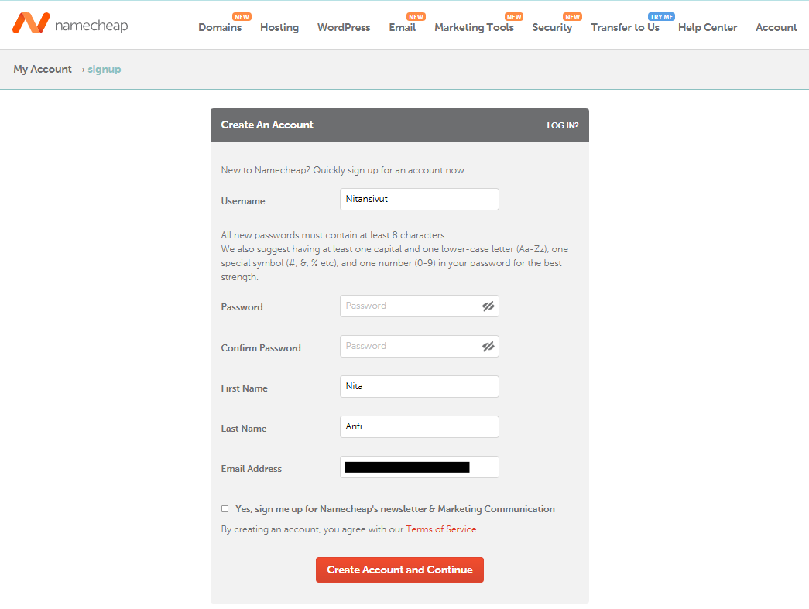
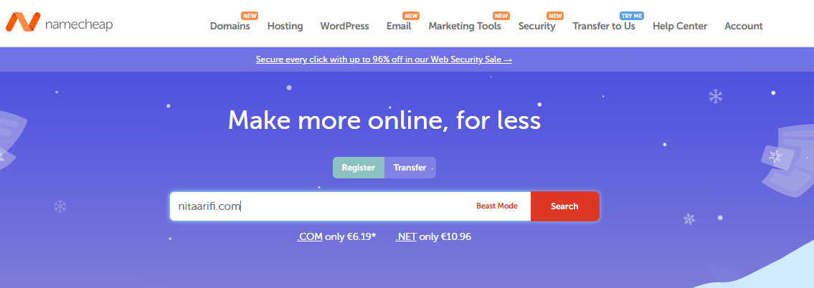
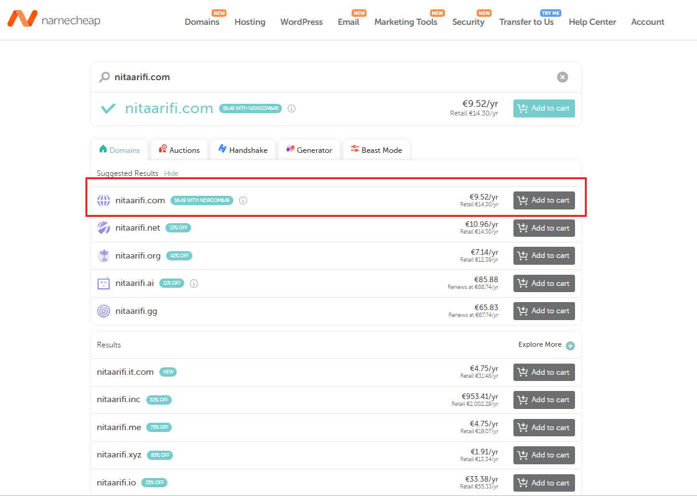
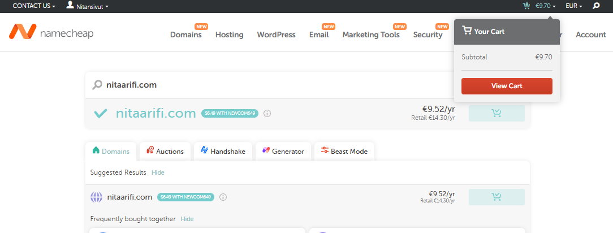
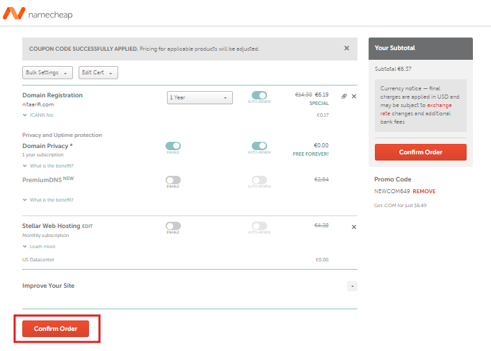
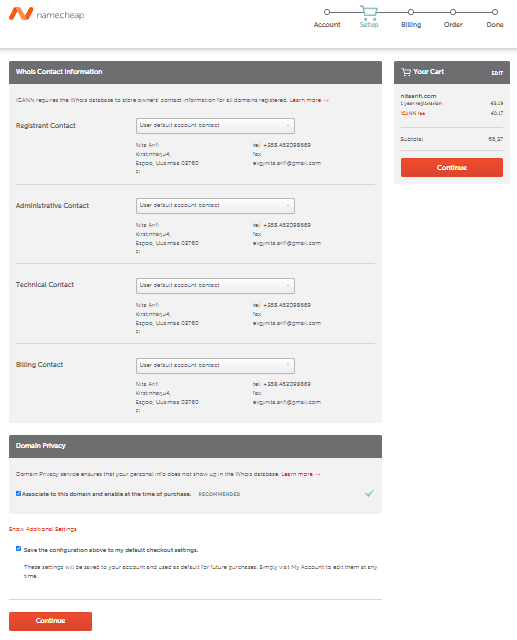
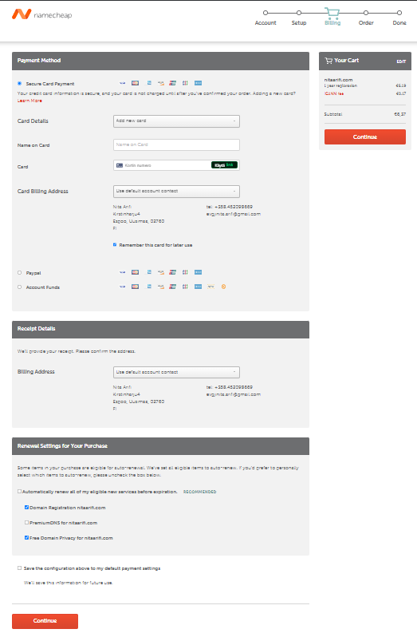
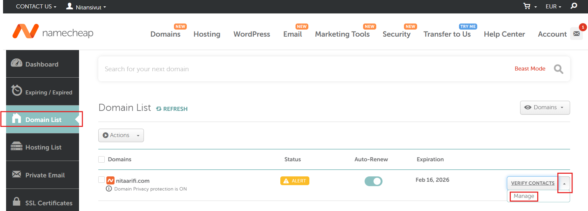
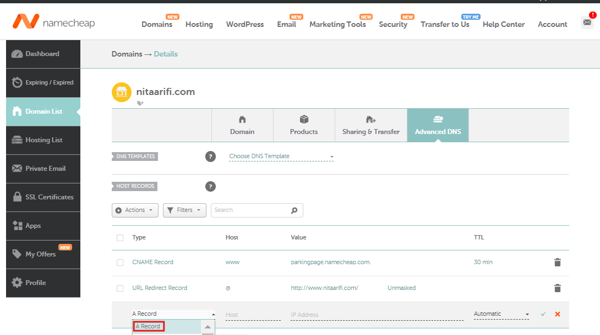
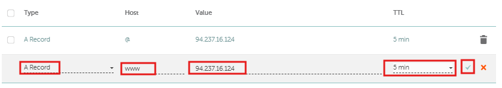

# Julkisen verkkotunnuksen määrittäminen omaan koneeseen

Tämän viikon tehtävänä oli saada julkinen nimi ohjaamaan omaan palvelimeeni, jonka ostin ja konfiguroin viime viikolla. Raportin siitä, kuinka ostin ja konfiguroin palvelimeni, löydät [täältä kohdasta a)](https://github.com/Nitansivut/linux-course/blob/main/h4.md). 

Tämän viikon tavoitteena oli saada valitsemani verkkotunnus ohjaamaan suoraan palvelimelleni. Viime viikolla luotu palvelimeni on se laite, joka "isännöi" verkkosivustoani ja tekee sen saataville internetiin. Verkkotunnus ohjaa liikenteen palvelimelle, joka sitten lähettää sivuston sisällön käyttäjän selaimelle, jolloin sivu näkyy oikein.

Verkkotunnus on osoite, joka vie internetissä tietylle verkkosivulle. Se toimii kuin talon osoite, mutta verkossa. Esimerkiksi terokarvinen.com on verkkotunnus, joka ohjaa tietylle sivustolle. Verkkotunnus helpottaa verkkosivuston löytämistä ilman, että tarvitsisi muistaa pitkiä ja monimutkaisia IP-osoitteita, jotka koostuvat numerosarjoista.

Hankin verkkotunnuksen [Namecheap-nimisestä palvelusta](https://www.namecheap.com/). Prosessi alkoi luomalla käyttäjätilin [rekisteröitymissivun](https://www.namecheap.com/myaccount/signup/) kautta.

Käytin omaa henkilökohtaista sähköpostiosoitetta rekisteröitymiseen, sillä koulun sähköpostilla se ei onnistunut.

Rekisteröitymisen jälkeen aloin tutkimaan, että miten voin ostaa verkkotunnuksen. Klikkasin Namecheaping logoa vasemmalta yläreunalta, jotta pääsisin takaisin etusivulle. Tämän jälkeen kirjoitin etusivulla olevaan hakukenttään verkkotunnuksen, jonka haluaisin itselleni.

Hakutuloksissa näytettiin lista saatavilla olevista verkkotunnuksista hintoineen. Valitsin ensimmäisen, nitaarifi.com, jonka hinta on alennuskoodin kanssa 6,37 € vuodessa.

Sitten siirryin ostoskoriini.

Lisäsin alennuskoodin ja vahvistin tilaukseni.

Tilauksen vahvistamisen jälkeen minut ohjattiin sivulle, jossa minun tuli täydentää tilin yhteystietoja, kuten katuosoite, postinumero, kaupunki, maakunta ja puhelinnumero. Tämän jälkeen painoin "Continue"-painiketta.

Seuraavaksi minun täytyi täyttää Whois-tiedot, jotka sisältävät verkkotunnuksen omistajan yhteystiedot. Jätin kaikki kentät oletusasetuksilla ja valitsin "User default contact" -vaihtoehdon ennen kuin painoin "Continue".

Lopuksi valitsin maksutavaksi korttimaksamisen, lisäsin korttitiedot ja viimeistelin maksamisen.

Maksamisen jälkeen siirryin vasemman yläreunan kautta Dashboard > Domain list > Verify contacts > Manage.

Sitten Advances DNS-välilehdeltä loin A-tietueen jossa hostina oli @ ja toisen jossa oli wwww.

---

**Lähteet**

https://www.cnet.com/tech/web-hosting-vs-domain/

----

# b) Name Based Virtual Host näkymään uudessa nimessäni

Name based virtual hosting tarkoittaa, että voin isännöidä useita verkkosivustoja samalla palvelimella ja Apache tunnistaa, mikä verkkosivusto tulee ladata sen mukaan, mikä verkkotunnus pyytää sivustoa. 

Sitten otin VirtualHostin käyttöön Apachella:

