# a) Julkisen verkkotunnuksen määrittäminen omaan koneeseen

Tämän viikon tehtävänä oli ohjata valitsemani julkinen verkkotunnus suoraan palvelimelleni, jonka ostin ja konfiguroin edellisellä viikolla. Raportin palvelimen hankinnasta ja konfiguroinnista löydät [täältä kohdasta a)](https://github.com/Nitansivut/linux-course/blob/main/h4.md).

Palvelimeni isännöi verkkosivustoani ja tekee sen saataville internetiin. Verkkotunnus toimii osoitteena, jonka avulla käyttäjät voivat päästä sivustolleni ilman, että heidän tarvitsee muistaa pitkiä IP-osoitteita.

## Vaihe 1

Hankin verkkotunnuksen [Namecheap-nimisestä palvelusta](https://www.namecheap.com/). Prosessi alkoi luomalla käyttäjätilin [rekisteröitymissivun](https://www.namecheap.com/myaccount/signup/) kautta. Käytin henkilökohtaista sähköpostiosoitetta, koska koulun sähköpostilla ei onnistunut.

## Vaihe 2

Rekisteröitymisen jälkeen aloin tutkimaan, että miten voin ostaa verkkotunnuksen. Klikkasin Namecheap:n logoa vasemmalta yläreunalta, jotta pääsisin takaisin etusivulle. Tämän jälkeen kirjoitin etusivulla olevaan hakukenttään verkkotunnuksen, jonka haluaisin itselleni.

Hakutuloksissa näytettiin lista saatavilla olevista verkkotunnuksista hintoineen. Valitsin ensimmäisen, nitaarifi.com, jonka hinta on alennuskoodin kanssa 6,37 € vuodessa.

Sitten siirryin ostoskoriini.

Lisäsin alennuskoodin ja vahvistin tilaukseni.

Tilauksen vahvistamisen jälkeen minut ohjattiin sivulle, jossa minun tuli täydentää tilin yhteystietoja, kuten katuosoite, postinumero, kaupunki, maakunta ja puhelinnumero. Tämän jälkeen painoin "Continue"-painiketta.

Seuraavaksi minun täytyi täyttää Whois-tiedot, jotka sisältävät verkkotunnuksen omistajan yhteystiedot. Jätin kaikki kentät oletusasetuksilla ja valitsin "User default contact" -vaihtoehdon ennen kuin painoin "Continue".

Lopuksi valitsin maksutavaksi korttimaksamisen, lisäsin korttitiedot ja viimeistelin maksamisen.

---

**Lähteet**

https://www.cnet.com/tech/web-hosting-vs-domain/

----

# b) Name Based Virtual Host näkymään uudessa nimessäni

Tässä tehtävässä tavoitteena oli määrittää Apache-palvelimelle Name Based Virtual Host, jotta verkkosivustoni nitaarifi.com voidaan palvella palvelimellani ilman, että se vaikuttaa muihin palvelimella oleviin sivustoihin. Tämä mahdollistaa useiden verkkosivustojen isännöinnin samalla palvelimella, mutta erillisinä virtuaalisina isäntinä. Lisäksi varmistin, että kotisivuni tiedostojen muokkaaminen onnistuu ilman pääkäyttäjäoikeuksia

## Vaihe 1 

Vasemman yläreunan kautta Dashboard > Domain List > Verify Contacts > Manage.

Advaced DNS -välilehdeltä loin A-tietueet, joista ensimmäisessä hostina oli "@", ja toisessa "www".

 

## Vaihe 2

Avasin Apache-konfiguraatiotiedoston käyttäen sudoedit-komentoa.

Muokkasin sen seuraavasti:

Päivitin Apache-konfiguraatiotiedoston uudelleen lisätäkseni puuttuvan Require all granted -määräyksen.

## Vaihe 3

Kun olin lisännyt VirtualHostin, otin sen käyttöön Apache-palvelimella.

Tämän jälkeen käynnistin Apachen uudelleen, jotta muutokset astuisivat voimaan.

## Vaihe 4

Seuraavaksi loin hakemiston, johon kotisivuni tallennetaan.

Määritin, että käyttäjä nita voi muokata verkkosivuston tietoja ilman pääkäyttäjäoikeuksa.

Lopuksi testasin, että kaikki toimii oikein. Kirjoitin selaimeen http://nitaarifi.com ja verkkosivustoni näkyi oikein. 

---

# c) Kotisivun luominen ja palvelimelle siirtäminen

Seuraavaksi tehtävänä oli tehdä yksinkertaisen kotisivun, jossa on kolme alasivua:index.html (Etusivu), blog.html (Blogisivu) ja projects.html (Projektisivu). Kaikki sivut sisältävät perusrakenteen ja navigointilinkit, jotta käyttäjä voi siirtyä sivulta toiselle. Lisäksi ne sijoitetaan hakemistoon, johon minulla on käyttöoikeus ilman pääkäyttäjäoikeuksia.

## 1. Vaihe: Luodaan hakemisto ja anna oikeudet käyttäjälleni

Koska /var/www on yleensä pääkäyttäjän hallinnoima hakemisto, luodaan alihakemisto ja annetaan se minun käyttäjälleni:

mkdir -p /var/www/nitaarifi → Luo hakemiston
chown -R nita:nita /var/www/nitaarifi → Vaihtaa hakemiston omistajaksi minut (käyttäjä nita)
chmod -R 755 /var/www/nitaarifi → Asettaa oikeudet niin, että Apache voi lukea tiedostot, mutta vain minä voit muokata niitä

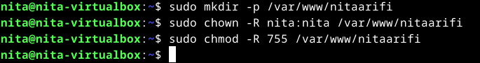

## 2. Vaihe: Luodaan HTML-tiedostot

Sitten loin ja kopioin tiedostot sinne ilman pääkäyttäjäoikeuksia.

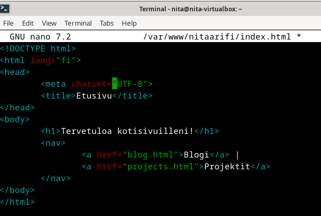

Sittein aloitin tekemään blog.html.

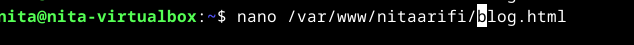

Ja lisäsin nämä tiedot siihen.

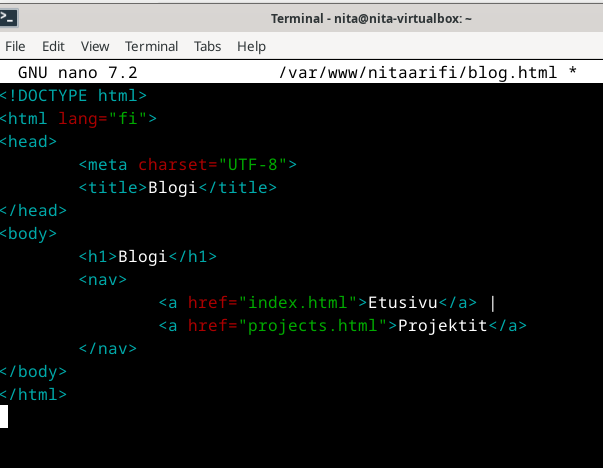

Lopuksi tein projects.html:

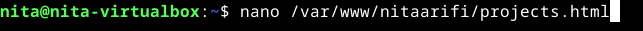

Ja lisäsin nämä tiedot siihen.

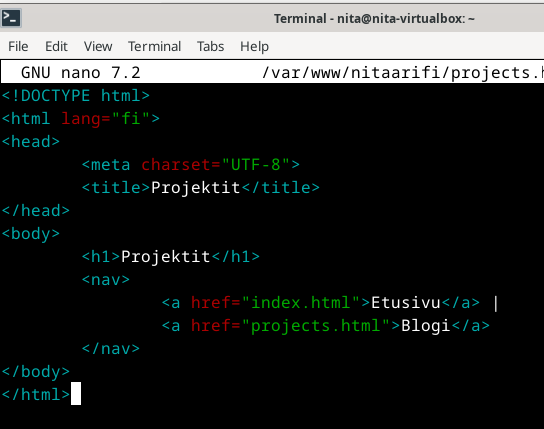

## 3. Vaihe: Testataan selaimessa

Hain selaimella osoitteella http://nitaarifi.com ja sivu ohjasi aiemmassa tehtävässä tehdylle sivulle. Kysyin chatgbt:ltä, että mistä tämä johtuu ja selvisi, että Apache ei käytäkään /var/www/nitaarifi-hakemistoa, vaan se hakee sivuston tiedostot hakemistosta /home/nita/public_sites/nitaarifi.com. Joten minun pitää kopioida uudet HTML-tiedostoni sinne, eikä /var/www/nitaarifi-hakemistoon.

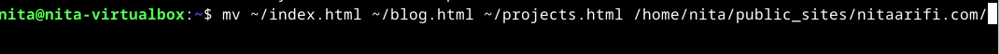

Siirsin tiedostot oikeaan paikkaan.

Silti ei toiminut. Tiedustelin Geminiltä, että missä ongelma voisi piiletä ja se sanoi, että minun tulisi luoda uuden määritystiedoston tätä tehtävää varten, joten tein niin ja siirsin tiedostot sinne. Ei auttanut tämäkään.

Päivitetty 23.2. klo 21.00.

Päätin kokeilla vielä index.html, blog.html sekä projects.html tiedoston luontia uudestaan. Sitten annoin Apachelle oikeudet lukea ja palvella tiedostoja komennolla sudo chown -R www-data:www-data /home/nita/public_sites/nitaarifi.com ja sitten muutin hakemiston oikeuksia sudo chmod -R 755 /home/nita/public_sites/nitaarifi.com. Käynnistin apachen uudelleen ja kokeilin selaimella taas, ja nyt ei toimi vanhakaan sivu. 

Päivitetty 25.2. klo 18.00

Päätin aloittaa tehtävän alusta. Siskoni vilkaisi tehtävääni ja huomautti, etten ollut kirjautunut palvelimelleni SSH-yhteyden kautta lainkaan. Tällä kertaa aloitin oikein ja kirjauduin UpCloud-palvelimelleni SSH-yhteyden avulla.

Ensimmäiseksi loin palvelimelle hakemiston kotisivujen tiedostoja varten. Sen jälkeen käytin Nano-editoria luodakseni kolme HTML-tiedostoa samalla tavalla kuin aiemmissa yrityksissäni. Kun tiedostot olivat valmiit, siirsin ne palvelimen julkiseen hakemistoon, /var/www/html. Käytin sudo cp -komentoa kopiointiin ja varmistin, että tiedostojen omistajuus oli oikea muuttamalla sen käyttäjätililleni sudo chown -komennolla.

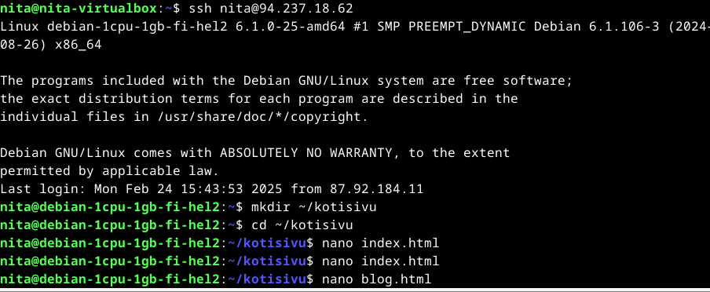

Tämän jälkeen lähti toimimaan. 

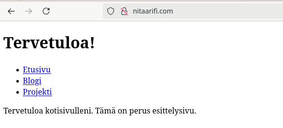

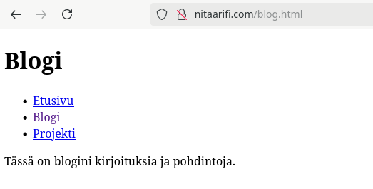

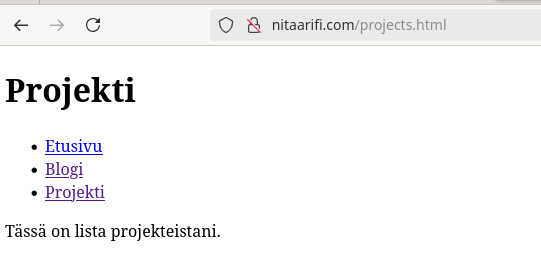

---

# d) Alidomainien luominen ja konfigurointi

Luodaan kaksi alidomainia, jotka osoittavat omaan palvelimeen ja näyttävät saman sivun kuin päädomeeni.

## 1. Vaihe: Alidomainien luominen Namecheapissa

Ensimmäiseksi loin kaksi alidomainia linuxkurssi.nitaarifi.com ja test.nitaarifi.com Namecheapissa.

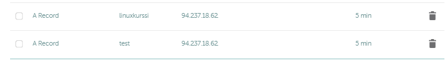

## 2. Vaihe: Apache-konfiguraation määrittäminen

Apache-palvelimella määritin virtuaali-isännät molemmille alidomaineille, jotta ne näyttävät samaa verkkosivua kuin päädomaini nitaarifi.com. Molemmille alidomaineille luotiin konfiguraatiotiedostot linuxkurssi.nitaarifi.com.conf ja test.nitaarifi.com.conf.

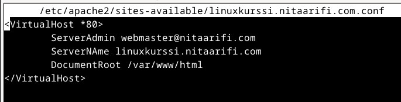

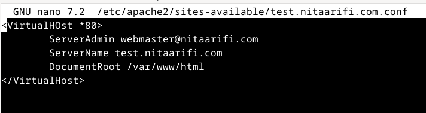

## 3. Vaihe: Apache-palvelimen päivitys

Konfiguraatiotiedostot aktivoinnin jälkeen Apache-palvelin ladattiin uudelleen, jotta muutokset astuivat voimaan. Komennolla sudo systemctl reload apache2 varmistin, että molemmat alidomainit toimivat oikein.

## 4. Vaihe: Testaus

Lopuksi testasin selaimella.

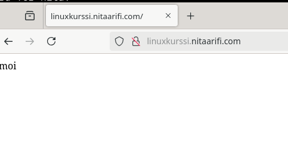

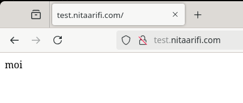

---

Lähteet

ChatGPT, OpenAI. "Miten määritän kaksi alidomainia ja kuinka konfiguroin Apachen. Käytän Namecheap -palvelua" Keskustelu, 23. helmikuuta 2025.

---

# e) DNS-tietojen tutkiminen host- ja dig-komennoilla

## 1. Vaihe: Tutkittavat domainit

Oma domain-nimeni: nitaarifi.com

Opettajan webbisivut: tekokarvinen.com

Suuri palvelu: Nelly.com

## 2. Vaihe: Dnsutils-paketin asentaminen 

Aloitin ajamalla ensin komennon sudo apt update, jolla päivitin pakettitiedot. Tämän jälkeen asensin dnsutils-paketin komennolla sudo apt install dnsutils. dnsutils-paketti sisältää useita hyödyllisiä DNS-työkaluja, kuten dig ja host.

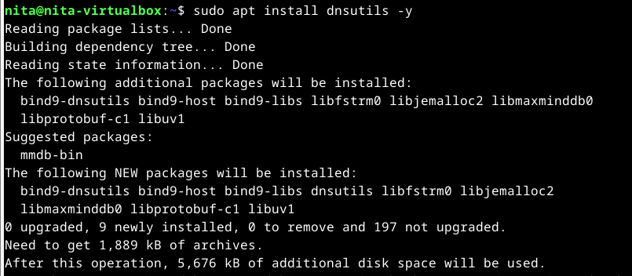

## 3. Vaihe: Host ja dig komennon käyttö ja tulosten analysointi

**nitaarifi:**

Host -komennolla näkyy, että nitaarifi.com -verkkotunnuksella on IP-osoite 94.237.18.62 ja sähköpostipalvelinten tiedot (MX-tietueet). Kuten kuvassa näkyy, niin on useita sähköpostipalvelimia, jotka käsittelevät nitaarifi.com -verkkotunnuksen sähköpostia.

ANSWER SECTION näyttää, että nitaarifi.com -verkkotunnuksella on yksi A-tietue, joka osoittaa IP-osoitteeseen 94.237.18.62. Query time kertoo kyselyn keston, SERVER kertoo käytetyn nimipalvelimen ja MSG SIZE rcvd kertoo vastaanotetun viestin koon.

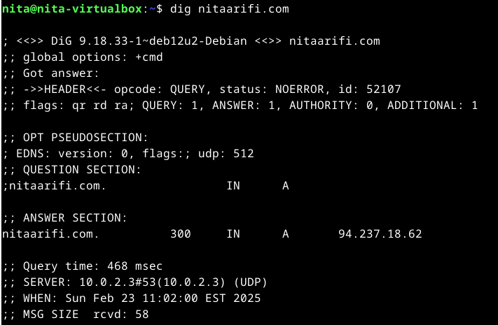

**terokarvinen.com:**

Host-komento näyttää, että terokarvinen.com -verkkotunnuksella on IP-osoite 139.162.131.217. On vain yksi sähköpostipalvelin, joka käsittelee terokarvinen.com -verkkotunnuksen sähköpostia.

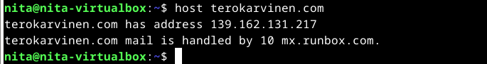

dig-komento vahvistaa, että terokarvinen.com -verkkotunnuksella on A-tietue, joka osoittaa IP-osoitteeseen 139.162.131.217. ANSWER SECTION näyttää, että A-tietueen TTL (Time To Live) on 6716 sekuntia. Tämä tarkoittaa, että DNS-palvelimet voivat tallentaa tämän tiedon välimuistiinsa 6716 sekunnin ajaksi.

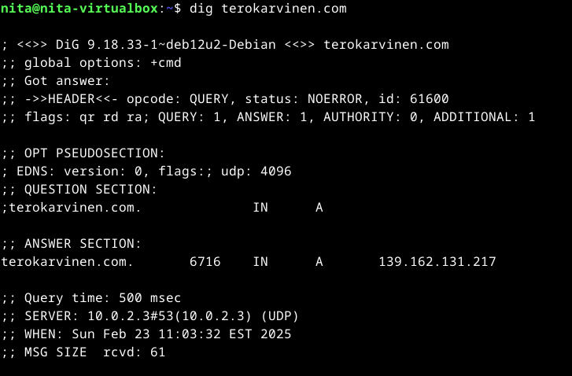

**nelly.com:**

host-komento näyttää, että nelly.com -verkkotunnuksella on useita IP-osoitteita (sekä IPv4 että IPv6). Tämä on yleistä suurille verkkosivustoille, jotka käyttävät useita palvelimia kuormanjakoon ja redundanssiin. Sähköpostiliikenne ohjataan Microsoftin sähköpostipalvelimelle (nelly-com.mail.protection.outlook.com).

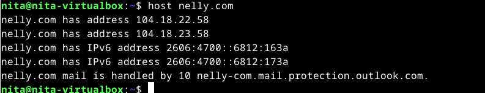

dig-komento vahvistaa, että nelly.com -verkkotunnuksella on kaksi A-tietuetta, jotka osoittavat IP-osoitteisiin 104.18.22.58 ja 104.18.23.58. Tämä selittää, miksi host-komento näytti useita IP-osoitteita. ANSWER SECTION näyttää, että A-tietueiden TTL (Time To Live) on 59 sekuntia. Tämä on melko lyhyt TTL, mikä tarkoittaa, että DNS-palvelimet päivittävät näitä tietoja usein.

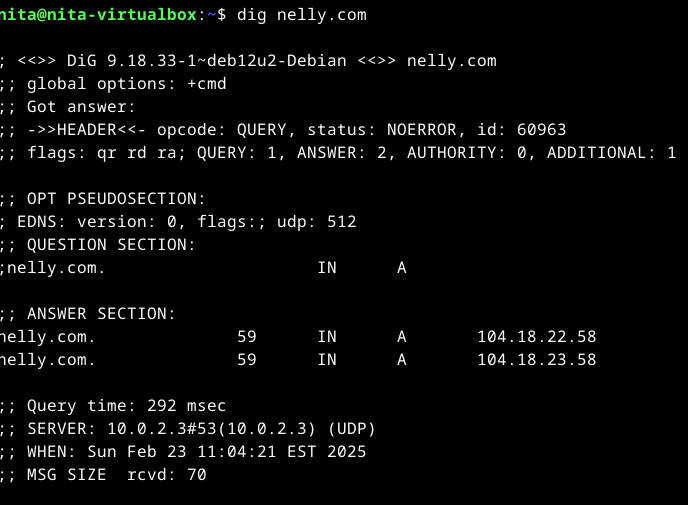

---

Lähteet

https://phoenixnap.com/kb/linux-dig-command-examples

https://phoenixnap.com/kb/linux-host

https://askubuntu.com/questions/25098/how-do-i-install-dig

---

# Tehtävissä b) - e) käytetty ympäristö

Kannettava tietokone
MalliVivoBook_ASUSLaptop X421IA_M433IA

Suoritin: AMD Ryzen 7 4700U with Radeon Graphics

RAM: 8 Gt

SSD-levyn koko: 476,07 Gt, josta vapaata tilaa: 357,07 Gt

Järjestelmätyyppi: 64-bittinen käyttöjärjestelmä, x64-suoritin

Käyttöjärjestelmä: Windows 11 Home

Virtuaalikone
Virtualisointi: Oracle Virtualbox versio 7.1.0 r164728 (Qt6.5.3)

Muisti: 4000 MB

CPU: 2

Virtuaalikovalevyn koko: 20.00 GB

Käyttöjärjestelmä: Debian GNU/Linux 12 (bookworm)

