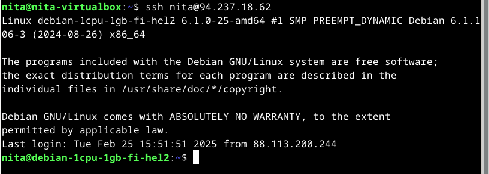
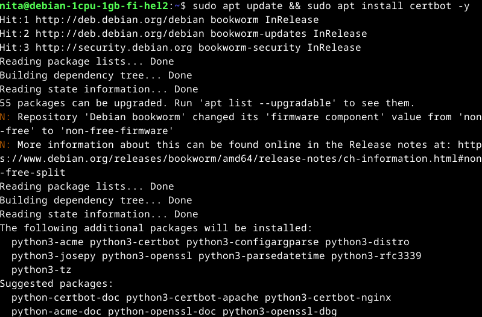
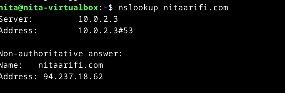
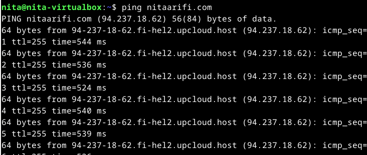
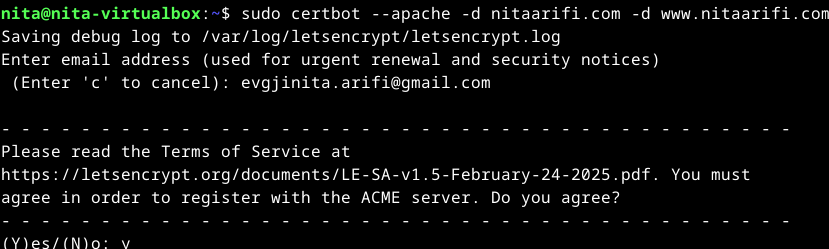
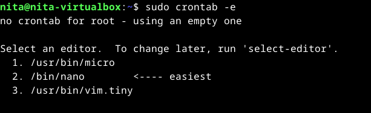
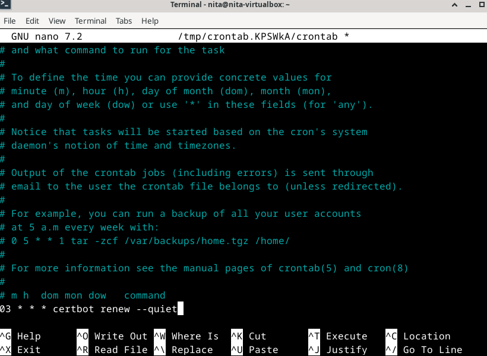
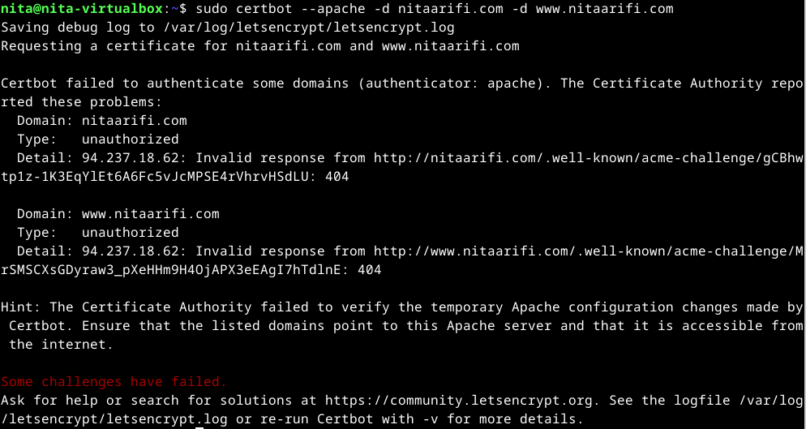
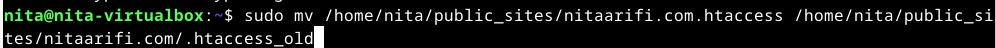

# x) Lets encrypt - How it works -kirjoituksen muistiinpanot

- Let’s Encrypt ja ACME-protokolla mahdollistavat automaattisen HTTPS-varmenteen hankinnan ilman ihmisen väliintuloa verkkopalvelimelle.
- Varmenteen hankinnan vaiheet:
  - Palvelimen on todistettava, että se hallitsee verkkotunnusta.
  - Kun hallinta on vahvistettu, palvelin voi pyytää, uusia ja perua varmenteita automaattisesti.
- Verkkotunnuksen hallinnan todistaminen:
  - Palvelimen ylläpitäjä tunnistetaan julkisella avaimella.
  - Ensimmäisellä käyttökerralla palvelinohjelmisto (agentti) luo avainparin ja todistaa verkkotunnuksen hallinnan varmentajalle (CA).
- CA antaa haasteita, joilla palvelin voi todistaa hallinnan, esim.:
  - Lisäämällä tietyn DNS-tietueen verkkotunnukseen.
  - Luomalla tietyn tiedoston palvelimen verkkosivulle.
- Palvelin suorittaa yhden haasteista ja allekirjoittaa CA:n antaman nonce-arvon yksityisellä avaimellaan.
- CA tarkistaa haasteen suorittamisen ja myöntää palvelimelle oikeuden hallita verkkotunnuksen varmenteita.
- Sertifikaatin (varmenteen) myöntäminen:
  - Kun palvelin on valtuutettu, se voi pyytää varmenteen.
  - Palvelin lähettää varmenteen allekirjoituspyynnön (CSR) CA:lle.
  - CA tarkistaa pyynnön, myöntää varmenteen ja tallentaa sen julkisiin Certificate Transparency -lokitietoihin.
- Sertifikaatin peruminen:
  - Jos varmenne täytyy perua, palvelin lähettää allekirjoitetun perumispyynnön CA:lle.
  - CA tarkistaa pyynnön ja julkaisee peruutustiedon, jolloin selain ei enää hyväksy sertifikaattia.

---
Lähteet

https://letsencrypt.org/how-it-works/

---

# x) Using an existing, running web server -kirjoituksen muistiinpanot

- Jos palvelin käyttää jo porttia 80, Let’s Encrypt -varmenteen hankkimiseksi käytettävä --http-vaihtoehto vaatii myös --http.webroot-vaihtoehdon.
- Mitä --http.webroot tekee?
    - Se ei käynnistä uutta palvelinta, vaan yksinkertaisesti luo ja tallentaa haasteen tunnustiedoston palvelimen tiedostojärjestelmään.
    - Tämä tiedosto sisältää HTTP-01-haasteen tunnuksen, joka tallennetaan hakemistoon .well-known/acme-challenge.
- Miksi tämä hakemisto on tärkeä?
    - Hakemiston täytyy olla julkisesti saatavilla verkkotunnuksen juurena (/), jotta Let’s Encrypt -palvelin voi pyytää haasteen tiedoston ja vahvistaa palvelimen hallinnan.
    - Esimerkiksi, jos haasteen tiedosto luodaan /path/to/webroot/.well-known/acme-challenge/, se tulisi olla saavutettavissa URL-osoitteesta: http://example.com/.well-known/acme-challenge/<haasteen_tiedosto>
- Mitä tehdä, jos hakemisto ei ole julkisesti saatavilla?
    - Palvelimen täytyy uudelleenohjata tai uudelleenkirjoittaa pyynnöt tähän hakemistoon.
    - Tämä voidaan tehdä esimerkiksi verkkopalvelimen asetuksissa (Apache, Nginx, jne.) lisäämällä sääntö, joka ohjaa kaikki .well-known/acme-challenge -polun pyynnöt oikeaan hakemistoon.
- Esimerkki: Lego-työkalun käyttö varmenteen hakemiseen
    - Jos käytössä on nykyinen web-palvelin portilla 80, haasteen voi suorittaa seuraavalla komennolla: lego --accept-tos --email you@example.com --http --http.webroot /path/to/webroot --domains example.com run

---

Lähteet

https://go-acme.github.io/lego/usage/cli/obtain-a-certificate/index.html#using-an-existing-running-web-server

---

%) How to: Basic configuration example -kirjoituksen muistiinpanot

---

Lähteet

https://httpd.apache.org/docs/2.4/ssl/ssl_howto.html#configexample

---

# a) Ilmaisen TLS-sertifikaatin hankkiminen ja asentaminen Let's Encryptilta

Vaihe 1: Aloitin tehtävän kirjautumalla palvelimelle SHH:n kautta. 

Vaihe 2: Päivitin järjestelmän ja asensin Certbotin

Asensin myös lisämoduulin Chatgbt:n suosituksesta.

Vaihe 3: Asetin DNS-tietueet osoittamaan palvelimeni IP-osoitteeseen (94.237.18.62) viime viikolla, ja nyt vain varmistin, että ne ovat edelleen oikein.

Vaihe 4: TLS-sertifikaatin asentaminen

Painoin "y" kirjainta kaikissa kodissa, joissa pyydettiin y/no vastausta.

Vaihe 5: Let's Encryptin sertifikaatit ovat voimassa 90 päivää, joten laitoin sertifikaatin uudistumaan automaattisesti.

Valitsin nano editorin ja laitoin sertifikaatin usiutumaan joka päivä klo 03:00.

Tallensin tiedoston painamalla Ctrl + O ja sitten Enter.

Vaihe 6: Koitin testata, että HTTPS toimii selaimella, mutta sivu näytti, että siihen ei saada yhteyttä. Sitten koitin uudelleen Certbot-komentoa ja luin tarkemmin sen tulosteen.

Tarkistin DNS-asetukset, palomuurin ja Apache-määritykset, enkä löytänyt ongelman syytä. Seuraavaksi keskityin .htaccess-tiedostoon ja tiedostojärjestelmän oikeuksiin.

.htaccess-tiedosto:Varmistin, että .htaccess-tiedosto ei estä pääsyä hakemistoon /.well-known/acme-challenge/.
Testatakseni tämän, nimesin .htaccess-tiedoston väliaikaisesti uudelleen seuraavalla komennolla:

sudo mv /home/nita/public_sites/nitaarifi.com/.htaccess /home/nita/public_sites/nitaarifi.com/.htaccess_old

Tämän jälkeen suoritin Certbotin uudelleen:

sudo certbot --apache -d nitaarifi.com -d www.nitaarifi.com

Jos Certbot onnistui, ongelman aiheutti .htaccess-tiedosto. Tämän perusteella tutkin tiedoston sisältöä ja muokkasin sitä sallimaan pääsyn hakemistoon /.well-known/acme-challenge/. Aloitin varmistamalla, että .htaccess-tiedosto ei estä pääsyä hakemistoon /.well-known/acme-challenge/.Testatakseni tämän, nimesin .htaccess-tiedoston väliaikaisesti uudelleen seuraavalla komennolla: 

Sitten suoritin Certbotin uudelleen, mutta ongelma jatkui. 

Mikä voisi olla ongelman syy?

---

Lähteet

OpenAI (2025). ChatGPT – tekninen ohjeistus. Saatavilla: OpenAI ChatGPT-palvelu [Haettu: 1.3.2025].

---

# a) TLS-sertifikaatin laadun arviointi SSL Labsilla

Vaihe 1: Avasin selaimen ja siirryin [SSL Labsin SSL Test -sivulle](https://www.ssllabs.com/ssltest/). Tarkoituksenani oli syöttää verkkosivuni URL-osoite (https://nitaarifi) testauskenttään ja painaa "Submit". Kuitenkin huomasin, että en voinut suorittaa tätä tehtävää ennen kuin a)-tehtävä oli suoritettu ja Let's Encrypt -sertifikaatti asennettu.

---

Lähteet 

---

